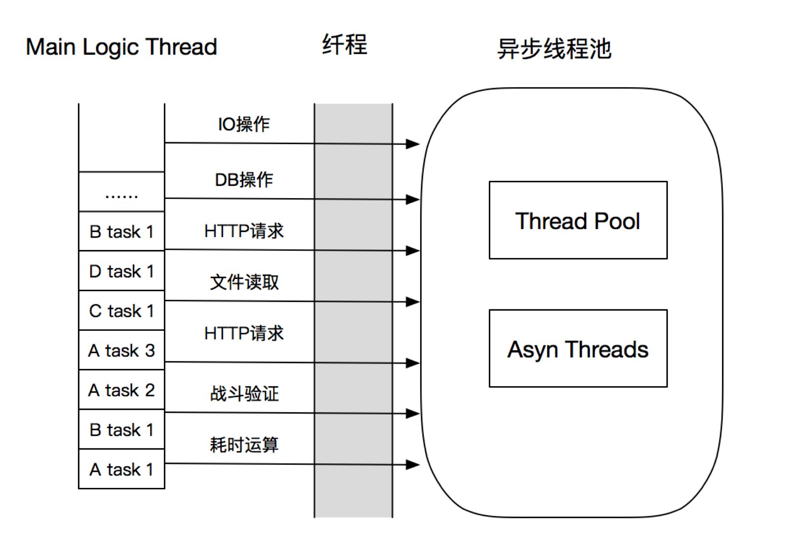
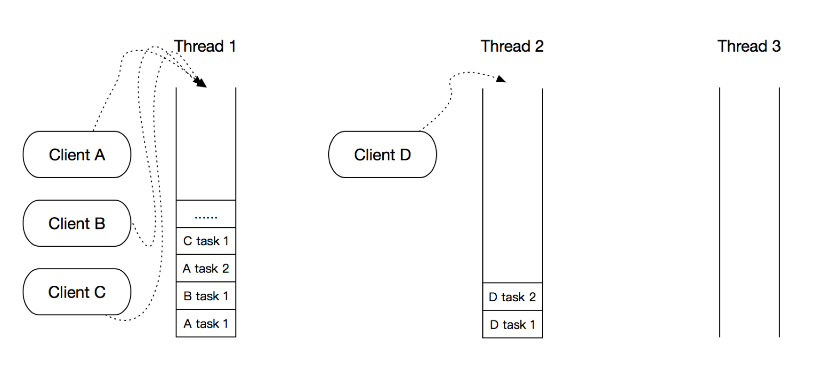
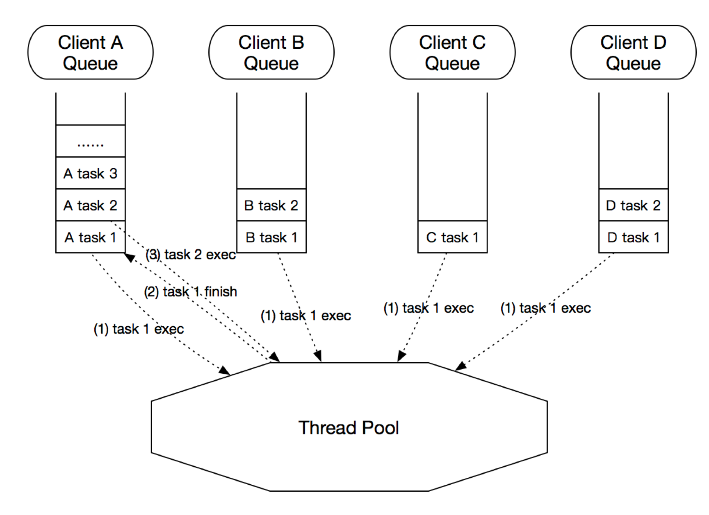

[toc]

## 18 | 什么情况下 Java 程序会产生死锁？如何定位、修复？

### 问题

-   **什么情况下 Java 程序会产生死锁？如何定位、修复？**

### 回答

1.  死锁定义：
    -   在实体间，由于循环依赖导致彼此一直处于等待，没有任何个体可以前进。
2.  多线程场景中的死锁：
    -   **指两个或多个线程之间，由于互相持有对方需要的锁，而永久处于阻塞的状态**。
3.  示例图
    -   
4.  定位死锁
    -   **jstack** 获取线程栈，然后定位互相间的依赖关系，进而找到死锁。
    -   **JConsole** 图形界面。
5.  解决死锁
    -   运行时，重启。
    -   运行前，代码审查、利用工具进行预防性排查。

### 分析

1.  写一个死锁程序，了解基本的线程编程。
2.  诊断死锁工具？
3.  如何在编程中尽量避免一些典型场景的死锁？

### 扩展

#### 一个基本的死锁程序

1.  代码

    -   ```java
        public class DeadLockSample extends Thread {
            private final String first;
            private final String second;
        
            public DeadLockSample(String name, String first, String second) {
                super(name);
                this.first = first;
                this.second = second;
            }
        
            public void run() {
                synchronized (first) {
                    System.out.println(this.getName() + " obtained: " + this.first);
                    try {
                        Thread.sleep(1000L);
                        synchronized (second) {
                            System.out.println(this.getName() + " obtained: " + this.second);
                        }
                    } catch (InterruptedException e) {
                        e.printStackTrace();
                    }
        
                }
            }
        
            public static void main(String[] args) throws InterruptedException {
                String lockA = "lockA";
                String lockB = "lockB";
        
                DeadLockSample t1 = new DeadLockSample("Thread1", lockA, lockB);
                DeadLockSample t2 = new DeadLockSample("Thread2", lockA, lockB);
                DeadLockSample t3 = new DeadLockSample("Thread3", lockA, lockB);
                DeadLockSample t4 = new DeadLockSample("Thread4", lockA, lockB);
                DeadLockSample t5 = new DeadLockSample("Thread5", lockA, lockB);
                DeadLockSample t6 = new DeadLockSample("Thread6", lockA, lockB);
                DeadLockSample t7 = new DeadLockSample("Thread7", lockA, lockB);
                DeadLockSample t8 = new DeadLockSample("Thread8", lockA, lockB);
        
                t1.start();
                t2.start();
                t3.start();
                t4.start();
                t5.start();
                t6.start();
                t7.start();
                t8.start();
        
                t1.join();
                t2.join();
                t3.join();
                t4.join();
                t5.join();
                t6.join();
                t7.join();
                t8.join();
            }
        }
        ```

    -   P.s 这段程序在我本地并没有复现出死锁。

2.  使用 jstack 获取线程栈：

    -   ```bash
        wangtaodeMac-mini:classes wangtao$ jstack {pid}
        ```

3.  分析输出

    -   

4.  实际应用中，定位死锁

    -   **区分线程状态 -> 查看等待目标 -> 对比 Monitor 等持有状态**

5.  使用 ThreadMXBean 提供的 findDeadlockedThreads() 方法定位。

    -   ```java
        
        public static void main(String[] args) throws InterruptedException {
        
          ThreadMXBean mbean = ManagementFactory.getThreadMXBean();
          Runnable dlCheck = new Runnable() {
        
              @Override
              public void run() {
                  long[] threadIds = mbean.findDeadlockedThreads();
                  if (threadIds != null) {
                             ThreadInfo[] threadInfos = mbean.getThreadInfo(threadIds);
                             System.out.println("Detected deadlock threads:");
                      for (ThreadInfo threadInfo : threadInfos) {
                          System.out.println(threadInfo.getThreadName());
                      }
                  }
               }
            };
        
               ScheduledExecutorService scheduler =Executors.newScheduledThreadPool(1);
               // 稍等5秒，然后每10秒进行一次死锁扫描
                scheduler.scheduleAtFixedRate(dlCheck, 5L, 10L, TimeUnit.SECONDS);
        // 死锁样例代码…
        }
        ```

#### 预防死锁

1.  死锁发生的原因
    -   互斥条件
    -   不可抢占
    -   循环依赖

##### **避免死锁的思路和方法**

1.  尽量**避免**使用多个锁，并且只有需要时才持有锁。
2.  如必须使用多个锁，尽量设计好锁的获取**顺序**。
3.  使用带**超时**的方法，为程序带来更多可控性。
4.  其他，如静态代码分析（FindBugs）。

### 分享

#### 通过线程模型避免使用锁

1.  开发中，**尽量不使用锁**是最简单避免锁的方式。避免多线程并发修改，则不需要使用锁。
2.  如下两种线程模型的实现不使用锁：
    -   **单业务逻辑线程 + 耗时逻辑异步处理**
        -   数据修改均使用主逻辑线程。
        -   IO 操作、耗时去处，均使用异步处理。
        -   使用 纤程(Quasar)，可让开发逻辑简化，按同步写法，由框架实现异步优化，不会出现 callback hell。
        -   
    -   **每个玩家有自己的处理线程**
        -   数据修改交给玩家所属线程处理
        -   当修改其他玩家数据，则以消息/任务的形式，发送给其他玩家的所属线程处理，以保证每个玩家数据只有一个线程处理，不使用锁。
        -   使用 `rid % ThreadNum`，分配对应的 Thread 处理
            -   
        -   以及，每个玩家有单独的处理队列，交由线程池串行处理
            -   

