[toc]

# JVM 核心技术

## 基础知识

### Java 概览

- 优势
	1. 生态
	2. JVM / GC
	3. 跨平台
- 字节码、类加载器、虚拟机内存
	- 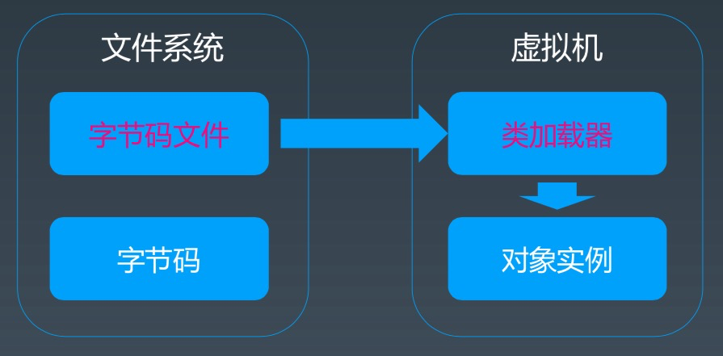

### Java 字节码

- 分类
	1.　栈操作指令，包括与局部变量交互的指令。（虚拟机本身需要）
	2.　程序流程控制指令（语言所需要）
	3.　对象操作指令，包括方法调用指令（语言所需要）
	4.　算术运算以及类型转换指令（语言所需要）
- 生成/  查看字节码
	- javac  xxxx.java -> xxxx.class
	- javap xxxx.class -> {bytecode}
- 算数操作
	- 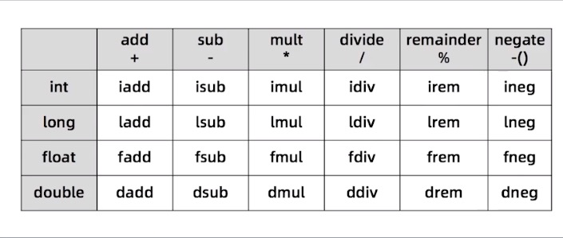
- 类型转换
	- 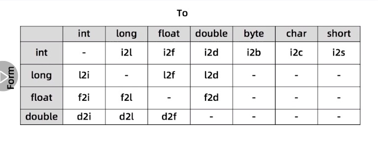
- 方法调用指令
	- Invokestatic: 顾名思义，这个指令用于调用某个类的静态方法，这是方法调用指令中最快 的一个。
		Invokespecial : 用来调用构造函数，但也可以用于调用同一个类中的 private 方法, 以及可 见的超类方法。
		invokevirtual : 如果是具体类型的目标对象，invokevirtual 用于调用公共、受保护和 package 级的私有方法。
		invokeinterface : 当通过接口引用来调用方法时，将会编译为 invokeinterface 指令。
		invokedynamic : JDK7 新增加的指令，是实现“动态类型语言”(Dynamically Typed Language)支持而进行的升级改进，同时也是 JDK8 以后支持 lambda 表达式的实现基础。

### JVM 类加载器

- 类的生命周期
	- 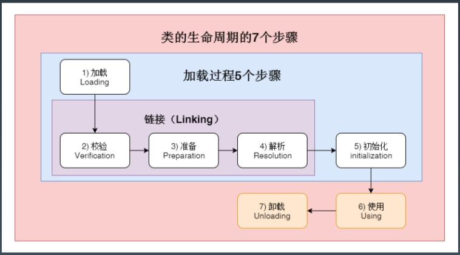
- 类的加载时机
	1. 当虚拟机启动时，初始化用户指定的主类，就是启动执行的 **main 方法**所在的类;
	2. 当遇到用以新建目标类实例的 new 指令时，初始化 **new 指令**的目标类，就是 new 一 个类的时候要初始化;
	3. 当遇到调用**静态方法**的指令时，初始化该静态方法所在的类;
	4. 当遇到访问**静态字段**的指令时，初始化该静态字段所在的类;
	5. 子类的初始化会触发**父类**的初始化;
	6. 如果一个接口定义了 default 方法，那么直接实现或者间接实现该接口的类的初始化， 会触发该接口的初始化;
	7. 使用反射 API 对某个类进行反射调用时，初始化这个类，其实跟前面一样，反射调用要 么是已经有实例了，要么是静态方法，都需要初始化;
	8. 当初次调用 MethodHandle 实例时，初始化该 MethodHandle 指向的方法所在的类。
- 不会初始化

	1. 通过子类引用父类的静态字段，只会触发父类的初始化，而不会触发子类的初始化。
	2. 定义对象数组，不会触发该类的初始化。
	3. 常量在编译期间会存入调用类的常量池中，本质上并没有直接引用定义常量的类，不 会触发定义常量所在的类。
	4. 通过类名获取 Class 对象，不会触发类的初始化，Hello.class 不会让 Hello 类初始 化。
	5. 通过 Class.forName 加载指定类时，如果指定参数 initialize 为 false 时，也不会触 发类初始化，其实这个参数是告诉虚拟机，是否要对类进行初始化。 (Class.forName”jvm.Hello”)默认会加载 Hello 类。
	6. 通过 ClassLoader 默认的 loadClass 方法，也不会触发初始化动作(加载了，但是 不初始化)。
- 三类加载器
	1. 启动类加载器(BootstrapClassLoader) 
	2. 扩展类加载器(ExtClassLoader)
	3. 应用类加载器(AppClassLoader)　
- 加载器特点
	- 双亲委托
	- 负责依赖
	- 缓存加载
- 添加引用类的几种方式
	1、放到 JDK 的 lib/ext 下，或者 -Djava.ext.dirs
	2、 java-cp/classpath 或者 class 文件放到当前路径
	3、自定义 ClassLoader 加载
	4、拿到当前执行类的 ClassLoader，反射调用 addUrl 方法添加 Jar 或路径(JDK9 无效)

### JVM 内存模型

- JVM 内存结构
	- 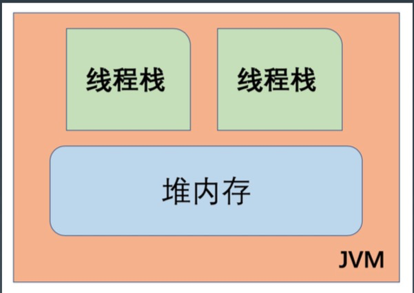
	- 每个线程**只能访问**自己的线程栈。
	- 每个线程都**不能访问**（看不见）其他线程的局部变量。
	- 所有**原生类型**的局部变量都存储在线程栈中，因此，对其他线程是不可见的。
	- 线程可以将一个原生变量值的**副本**传给另一个线程，但不能共享原生局部变量本身。
	- 堆内存中包含了 Java 代码中创建的**所有对象**，不管是哪个线程创建的。其他也涵盖了包装类型（如，Byte, Integer, Long 等）。
	- 不管是创建一个对象并将其赋值给局部变量，还是赋值给另一个对象的成员变量，创建的对象都会被保存在**堆内存**中。
	- 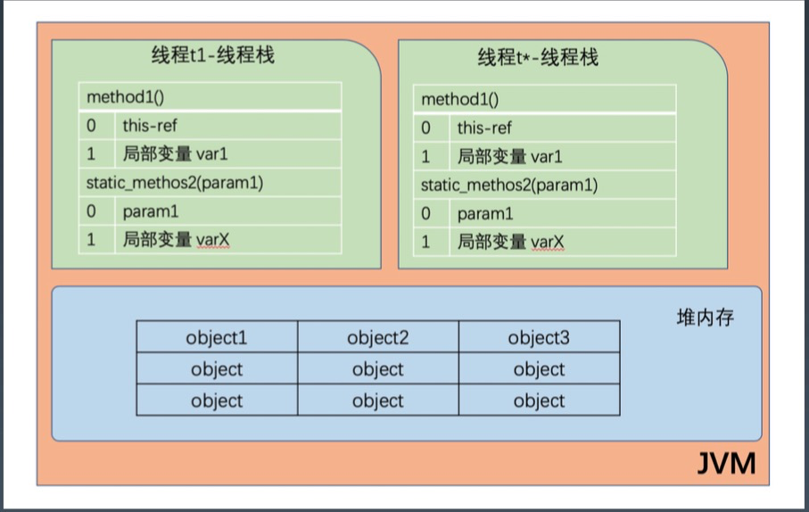
	- 如果是**原生数据类型的局部变量**，那么它的内容就全部保留在**线程栈**上。
	- 如果是对象引用，则**栈**中的局部变量槽位中保存着对象的**引用地址**，而实际的**对象内容**保存在**堆**中。
	- 对象的**成员变量与对象本身**一起存储在堆上，不管成员变量的类型是原生数值，还是对象引用。
	- 类的**静态变量则和类定义**一样保存在堆中。
	- 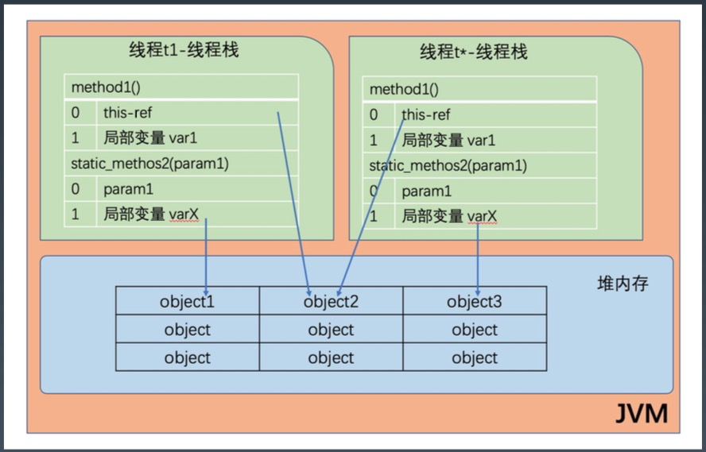
	- 总结
		- 方法中使用的原生数据类型和对象引用地址在**栈**上存储；对象、对象成员与类定义、静态变量在**堆**上。
		- 堆内存又称为“共享堆”，堆中的所有对象，可以被所有线程访问，只要他们能拿到对象的引用地址。
		- 如果一个线程可以访问某个对象时，也就可以访问该对象的成员变量。
		- 如果两个线程同时调用某个对象的同一个方法，则它们都可以访问到这个对象的成员变量，但每个线程的局部变量副本是**独立的**。
- JVM 内存整体结构
	- 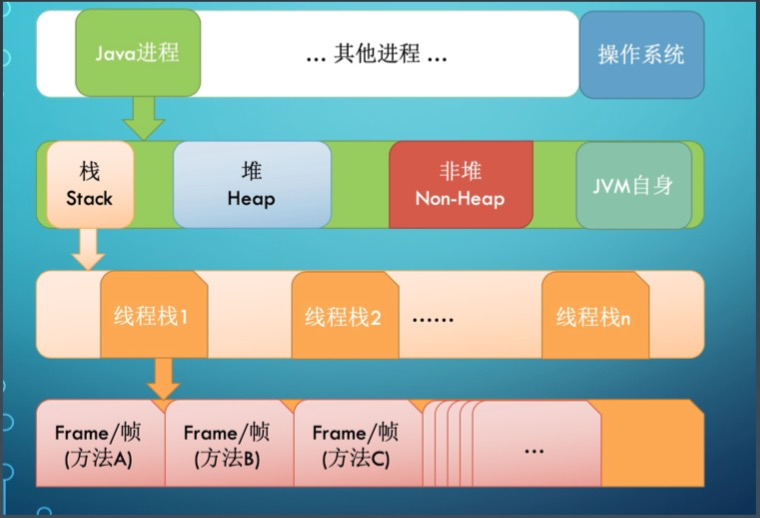
	- 每启动一个线程，JVM 就会在栈空间分配对应的线程栈。
	- 线程栈也叫 Java 方法栈。如果使用 JNI 方法，则会分配一个单独的本地方法栈（Native Stack）。
	- 线程执行过程中，一般会有多个方法组成调用栈（Stack Trace），每执行到一个方法，就会创建对应的栈帧（Frame）。
- JVM 栈内存结构
	- 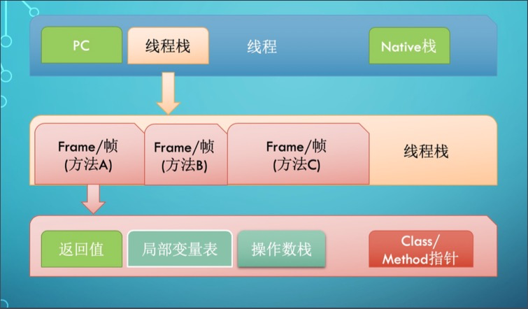
	- 栈帧是一个逻辑上的概念，具体的大小在一个方法编写完成后基本就能确定。
- JVM 堆内存结构
	- 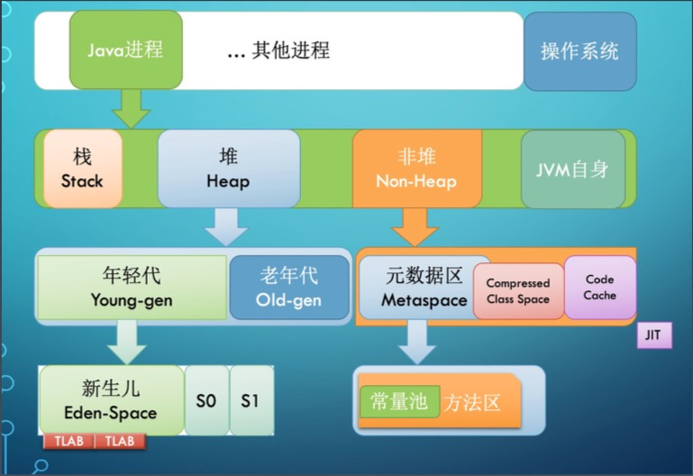
	- 堆（Heap）内存是所有线程共用的内存空间
		- JVM 将堆内存分为年轻代（Young-gen）和老年代（Old-gen）。
		- 年轻代还划分为 3 个内存池，新生代（Eden-space）和存活区（S0/S1）
	- 非堆（Non-Heap）本质上还是 Heap，只是一般不归GC 管理，里面划分为 3 个内存池。
		- Metaspace（持久代/永久代）
		- CSS（Compressed Class Space），存放 class 信息的，和 Metaspace 有交叉。
		- Code Cache，存放 JIT 编译器编译后的本地机器代码。
- JMM
	- [JSR-133. Java Memory Model and Thread Specification]，《Java 语言规 范》的 [$17.4. Memory Model章 节]
	- JMM 规范明确定义了不同线程之间，通过哪些方式，在什么时候可以看见其他线程保存到共享变量中的值；以及在必要时，如何对共享变量的访问进行同步。
	- 好处，屏蔽各种平台间的内存访问差异，实现了 Java 并发程序真正的跨平台。

### JVM 启动参数

-  格式

	- ```tex
		java [options] class [args]
		java [options] -jar filename [args]
		```

- 分类

	- 标准参数 -
	- 系统属性 -D
	- 非标准参数 -X
		- java -X
	- 非稳定参数 -XX
		- -XX: +-Flags，对布尔值进行开关。
		- -XX: key=value，指定某个选项的值。

- 分类（特点、作用）

	- 系统属性参数

		- 

			```bash
			# 命令行设置
			-Dfile.coding=UTF-8
			-Duser.timezone=GMT+08
			-Dmaven.test.skip=true
			-Dio.netty.eventLoopThreads=8
			
			# 程序内设置
			System.setProperty("a", "100");
			String a = System.getProperty("a");
			```

	- 运行模式参数

		- -server，启动速度慢，运行时性能和内存管理效率很高。
		- -client，启动速度快，但运行时性能和内存管理效率不高。
		- -Xint，解释模式
		- -Xcomp，编译模式
		- -Xmixed，混合模式（JVM 默认模式）

	- 堆内存设置参数

		- -Xmx，最大堆内存， 

			> 部署 Java 应用要资源隔离，防止多个 Java 应用抢资源。
			>
			> xmx <= 物理内存的70%（60～80）

		- -Xms，初始化大小

			> 建议配置大小和-Xmx 大小一致，降低 Full GC 抖动。

		- -Xmn，等价于 -XX:NewSize。

			> 官方建议为 -Xmx 的 1/2~1/4。

		- -XX: MaxPermSize=size，JDK1.7 之前使用，Java 8 无效。

		- -XX: MaxMetaspaceSize=size，Java 8 默认不限制 Meta 空间，不允许设置该参数。

		- -XX: MaxDirectMemorySize=size，最大堆外内存，等同 -Dsun.nio.MaxDirectMemorySize 。

		- -Xss，每个线程栈的字节数。

	- GC 设置参数（多且杂）

		- JDK 默认的 GC 是什么？

	- 分析诊断参数

	- JavaAgent 参数

## 工具与 GC 策略

### JDK 内置命令行工具

1. java
2. javac，编译
3. javap，反编译
4. javadoc，自动生成相关 API 文档
5. javah，java -> .h 文件
6. extcheck，检查 jar 版本冲突，使用较少
7. jdb，Java Debugger
8. jdeps，探测 class / jar 依赖
9. jar，打包工具
10. keytool，安全证书/密钥管理
11. jarsigner，jar 签名，验证

### JVM 命令行工具

1. jps -lmv / jinfo {pid}，查看 java 进程

	> 不同用户/不同 jdk 版本，可能会查不到。

2. jstat，查 GC 

  > 动态打印
  >
  > 
  >
  > 常用参数
  >
  > jstat -gc 91739 1000 1000 	（显示：字节数）
  > jstat -gcutil 91739 1000 1000 （显示：百分比）
  >
  > 

3. jmap，查看 heap 或类占用空间统计

	> 打印当前堆内存快照
	>
	> 
	>
	> -heap 堆内存配置和使用
	>
	> -histo 不同类占用空间多少，直方图
	>
	> -dump Dump 堆内存
	>
	> 
	>
	> 注：mac 环境下会有 bug，jdk9/10 以上版本修复

4. jstack，查看线程信息

	> -l 长列表模式，打印线程锁信息（常用）
	>
	> -F　
	>
	> -m
	>
	> 
	>
	> kill -3 同样效果

5. jcmd，执行 JVM 相关分析命令（整合）

  > (env) wangtaodeMac-mini:code wangtao$ jcmd 91739 help
  > 91739:
  > The following commands are available:
  > JFR.stop
  > JFR.start
  > JFR.dump
  > JFR.check
  > VM.native_memory
  > VM.check_commercial_features
  > VM.unlock_commercial_features
  > ManagementAgent.stop
  > ManagementAgent.start_local
  > ManagementAgent.start
  > VM.classloader_stats
  > GC.rotate_log
  > Thread.print
  > GC.class_stats
  > GC.class_histogram
  > GC.heap_dump
  > GC.finalizer_info
  > GC.heap_info
  > GC.run_finalization
  > GC.run
  > VM.uptime
  > VM.dynlibs
  > VM.flags
  > VM.system_properties
  > VM.command_line
  > VM.version
  > help

6. jrunscript/jjs，运行 js 命令

###  JDK 相关图形化工具

1. jconsole

	> jdk 早期较常用

2. jvisualvm

	> 较大版本，默认 jdk 没有包含此工具
	>
	> 功能强大、较多
	>
	> 
	>
	> 线程展示比 jconsole 更可视化
	>
	> sampler，堆抽样
	>
	> profiler
	>
	> 
	>
	> 其他类似，较为方便的一个工具 -- VisualGC，eclipace/idea 插件安装，使用

3. jmc

	> 官方工具中最强大的。 **推荐**熟练使用。
	>
	> JMC 从 2020.07后，不再打包到默认 jdk 中。需要手工下载安装。
	>
	> JMC 版本需要对应当前系统版本，否则会有卡死情况。
	>
	> 
	>
	> Java 飞行记录器：
	>
	> 记录一个时间段内状态变化情况。
	>
	> 并且，对原始数据进行了加工、分析、展示

### 扩展

1. jenv，支持多个 jdk 环境

## GC 的背景和一般原理

1. Y-gen
	- Eden/S0/S1 = 8/1/1

## 调优分析

### GC 日志分析和解读

1. 打印 GC 参数

	> -XX:+PrintGCDetails，打印 GC 信息，-XX:+PrintGC 概要信息
	>
	> -XX:+PrintGCDateStamps 打印 GC 时间戳
	>
	> -Xloggc:{GC LOG} 指定 GC 日志名
	>
	> 
	>
	> java 默认参数

	> -Xmx 内存大于 1G 时，1/4 内存；小于 1G 时，1/2 内存。
	>
	> -Xmx == -Xms 推荐

2. GC 日志分析

3. Java8 默认 GC 策略/ -XX:+UseParallelGC 并行 GC

	> PSYoungGen
	>
	> ParOldGen:
	>
	> 2021-11-13T11:51:19.371-0800: [GC (Allocation Failure) [PSYoungGen: 65407K->10734K(76288K)] 65407K->19061K(251392K), 0.0069045 secs] [Times: user=0.01 sys=0.02, real=0.00 secs] 
	>
	> 
	>
	> 分类
	>
	> {时间}: [{堆内存变量情况/GC 情况}] [{ CPU 使用情况}]
	>
	> {堆内存变量情况/GC 情况}　==> {GC 原因}，{GC 并行执行使用时间/GC 暂停时间}
	>
	> 
	>
	> 该垃圾回收器默认启动了 AdaptiveSizePolicy 自适应大小策略。
	>
	> -XX:+UseAdaptiveSizePolicy
	>
	> 参考：https://segmentfault.com/a/1190000016427465

4. Young GC / Full GC（yong gc + old gc）

	- Minor GC / Major GC

5. -XX:+UseSerialGC 串行 GC

	> DefNew
	>
	> Tenured 老年代
	>
	> 2021-11-13T12:15:42.396-0800: [GC (Allocation Failure) 2021-11-13T12:15:42.396-0800: [DefNew: 69499K->8704K(78656K), 0.0138857 secs] 69499K->22558K(253440K), 0.0139177 secs] [Times: user=0.01 sys=0.01, real=0.02 secs] 

6. -XX:+UseConcMarkSweepGC， CMS

	> 清理 OLD 区
	>
	> ParNew
	>
	> 2021-11-13T13:52:51.681-0800: [GC (Allocation Failure) 2021-11-13T13:52:51.681-0800: [ParNew: 279616K->34943K(314560K), 0.0360799 secs] 279616K->91983K(1013632K), 0.0361222 secs] [Times: user=0.05 sys=0.07, real=0.03 secs] 
	>
	> ......
	>
	> 2021-11-13T13:52:52.093-0800: [GC (CMS Initial Mark) [1 CMS-initial-mark: 379704K(699072K)] 421274K(1013632K), 0.0004674 secs] [Times: user=0.00 sys=0.00, real=0.00 secs] 

7. -XX:+UseG1GC，G1 GC

8. GC 相关工具

	> GCEasy，在线
	>
	> GCViewer，jar

### JVM 线程堆栈数据分析

1. JVM 线程模型示意图

	- 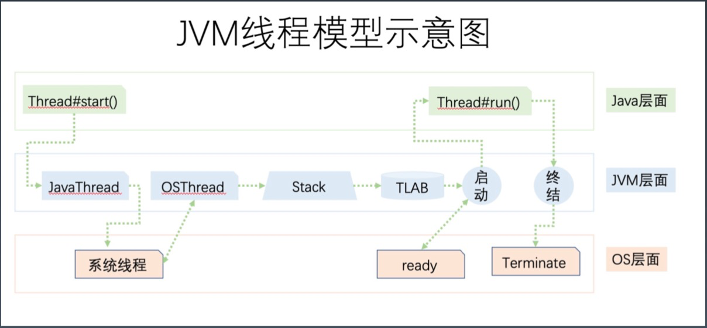

2. JVM 内部线程

	- VM 线程
	- 定时任务线程
	- GC 线程
	- 编译器线程
	- 信号分发线程
	- 其他：{业务线程}

3. 安全点

	1. 方法代码中被值入的安全点检测入口。
	2. 线程处于安全点状态：线程暂停执行，这个时候线程栈不再发生改变。
	3. JVM 的安全点状态：所有线程处于安全点状态。

4. JVM 线程转储：

	1. JDK 工具：

		> jstack
		>
		> jcmd
		>
		> jconsole
		>
		> jvisualvm
		>
		> ...

	2. SHELL

		> kill -3
		>
		> win, Ctrl+Break

	3. JMX

		> ThreadMxBean

5. 线程查看工具

	> fastthread，在线

### 内存分析与相关工具

1. JVM 中 Java 对象结构

	- 

2. 计算JVM 对象占用的内存大小

	> Instrumentation.getObjectSize()
	>
	> JOL(Java Object Layout)
	>
	> jmap -histo/jcmd --> heap info

3. 对象头和对象引用

	> 64 位，12-byte(=96bit=64+32)，以 8 个字节对齐。所以，一个空类的实例至少占用 16字节。
	>
	> 32 位，对象头 8 个字节，以 4 的倍数对齐（32＝4×8）
	>
	> 即使 new 出很多简单对象，也会占用不少空间。
	>
	> JVM 默认开启指针压缩
	>
	> 32 位，一个引用占4 个字节。64 位，一般多消耗堆内存。

4. 包装类型

	> 比原生数据类型消耗内存更多。
	>
	> Integer，占用 16 字节（头部 8＋4＝12，数据 4 字节），int 部分占用 4 字节。所以。Integer 比原生类型 int 要多消耗 300％的内存。
	>
	> Long，占用 24 字节（头部8＋4＋数据 8＝20字节，再对齐）。Long 类型比起原生的 long 多占用 8 个字节。也就是多消耗 200％。

5. 多维数组

	> 二维数据`int[dim1][dim2]`中，每个嵌套的数组`int[dim2]`都是一个单独的 Object，会额外占用 16个字节的空间。当维度更大时，这种开销更加明显。
	>
	> 建议，尽量少用。
	>
	> 如必须要用的话，用一维数组模拟。

6. String

	> String 24 个字节的额外开销。

7. 对齐

8. OOM

  -  OutOfMemoryError: Java heap space 

  	>原因
  >
  	>创建新的对象时，堆内存中的空间不足以存放新创建的对象。
  	>
    >解决方案
  >
  	>增加堆内存大小，

  -  OutOfMemoryError: PermGen space/ OutOfMemoryError: Metaspace 

  	> 加载到内存中的类数理太多或体积太大
  	>
  	> 增大　PermGen/Metaspace
  	>
  	> -XX:MaxPermSize
  	>
  	> -XX:MaxMetaspaceSize
  	>
  	> 
  	>
  	> 高版本 JVM 也可以（不一定好用）
  	>
  	> -XX:+CMSClassUnloadingEnabled

  -  OutOfMemoryError: Unable to create new native thread

  	> 程序创建的线程数量已经达到上限值。
  	>
  	> 1. 调用系统参数 ulimit -a, echo 120000 > /proc/sys/kernel/threads-max
  	> 2. 降低 Xss 参数
  	> 3. 调整代码，改变线程创建和使用方式。

9. 内存 Dump 分析工具

	1. Eclipse MAT
	2. jhat

### JVM 调优分析经验

1. 分配速率

	> 定义：年轻代创建新对象
	>
	> 
	>
	> 计算：上次 GC 后，与下次 GC 开始前的年轻代使用量，两者的差值除以时间，就是分配速率。
	>
	> 
	>
	> 三个状态
	>
	> 正常：分配速率 ~ 回收速率
	>
	> OOM: 分配速率> 回收速率
	>
	> 亚健康：分配速率很高 ~ 回收速率
	>
	> 
	>
	> 影响 -- "蓄水池效应"
	>
	> 影响 Young GC/Minor GC 的次数和时间，进而影响吞吐量。
	>
	> 
	>
	> 思路
	>
	> 降低 GC 暂停频率
	>
	> 
	>
	> 方法
	>
	> 增大 Young 区大小。Eden = Young * 80％，Young = head * 1/3
	>
	> 修改 Young / Old 区比例；
	>
	> 增大 Xmx；
	>
	> 

2. 晋升速率/提升速率

	> 年轻代->老年代
	>
	> 定义
	>
	> 单位时间内，从年轻代提升到老年代的数据量。
	>
	> 过早提升
	>
	> 对象存活时间还不够长的时候，就被提升到了老年代。
	>
	> 现象
	>
	> 1. 短时间内频繁 Full GC
	> 2. 每次 Full GC 后，老年代的使用率很低，在 10~20 %或以下
	> 3. 提升速率接近于分配速率
	>
	> 思路
	>
	> 1. 增加年轻代的大小
	> 2. 减少每次业务处理使用的内存数量
	>
	> 

###GC 疑难情况问题分析

1. Arthas 分析工具

2. JVM 问题分析解决

	1. 业务日志

	2. 系统资源/监控信息

	3. 性能指标

	4. 系统日志

	5. APM 应用性能监控

	6. 排查应用系统

		> 配置文件（重要，成本小/提升大/效果明显）
		>
		> GC 问题
		>
		> 线程
		>
		> 代码
		>
		> 单元测试

	7. 排除资源竞争、坏邻居效应

3. 案例分析

	> -XX:+UseG1GC 
	>
	> -XX:MaxGCPauseMillis=50，GC  暂停时间 50ms
	>
	> -XX:ParallelGCThreads=4，固定 GC 线程数 4

