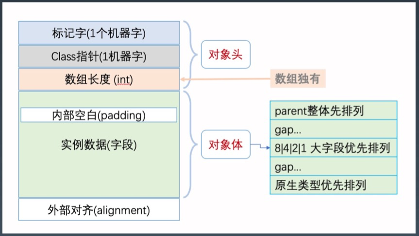

[toc]

# JVM 核心技术

## 基础知识

### Java 概览

- 优势
	1. 生态
	2. JVM / GC
	3. 跨平台
- 字节码、类加载器、虚拟机内存
	- 

### Java 字节码

- 分类
	1.　栈操作指令，包括与局部变量交互的指令。（虚拟机本身需要）
	2.　程序流程控制指令（语言所需要）
	3.　对象操作指令，包括方法调用指令（语言所需要）
	4.　算术运算以及类型转换指令（语言所需要）
- 生成/  查看字节码
	- javac  xxxx.java -> xxxx.class
	- javap xxxx.class -> {bytecode}
- 算数操作
	- 
- 类型转换
	- 
- 方法调用指令
	- Invokestatic: 顾名思义，这个指令用于调用某个类的静态方法，这是方法调用指令中最快 的一个。
		Invokespecial : 用来调用构造函数，但也可以用于调用同一个类中的 private 方法, 以及可 见的超类方法。
		invokevirtual : 如果是具体类型的目标对象，invokevirtual 用于调用公共、受保护和 package 级的私有方法。
		invokeinterface : 当通过接口引用来调用方法时，将会编译为 invokeinterface 指令。
		invokedynamic : JDK7 新增加的指令，是实现“动态类型语言”(Dynamically Typed Language)支持而进行的升级改进，同时也是 JDK8 以后支持 lambda 表达式的实现基础。

### JVM 类加载器

- 类的生命周期
	- 
- 类的加载时机
	1. 当虚拟机启动时，初始化用户指定的主类，就是启动执行的 **main 方法**所在的类;
	2. 当遇到用以新建目标类实例的 new 指令时，初始化 **new 指令**的目标类，就是 new 一 个类的时候要初始化;
	3. 当遇到调用**静态方法**的指令时，初始化该静态方法所在的类;
	4. 当遇到访问**静态字段**的指令时，初始化该静态字段所在的类;
	5. 子类的初始化会触发**父类**的初始化;
	6. 如果一个接口定义了 default 方法，那么直接实现或者间接实现该接口的类的初始化， 会触发该接口的初始化;
	7. 使用反射 API 对某个类进行反射调用时，初始化这个类，其实跟前面一样，反射调用要 么是已经有实例了，要么是静态方法，都需要初始化;
	8. 当初次调用 MethodHandle 实例时，初始化该 MethodHandle 指向的方法所在的类。
- 不会初始化

	1. 通过子类引用父类的静态字段，只会触发父类的初始化，而不会触发子类的初始化。
	2. 定义对象数组，不会触发该类的初始化。
	3. 常量在编译期间会存入调用类的常量池中，本质上并没有直接引用定义常量的类，不 会触发定义常量所在的类。
	4. 通过类名获取 Class 对象，不会触发类的初始化，Hello.class 不会让 Hello 类初始 化。
	5. 通过 Class.forName 加载指定类时，如果指定参数 initialize 为 false 时，也不会触 发类初始化，其实这个参数是告诉虚拟机，是否要对类进行初始化。 (Class.forName”jvm.Hello”)默认会加载 Hello 类。
	6. 通过 ClassLoader 默认的 loadClass 方法，也不会触发初始化动作(加载了，但是 不初始化)。
- 三类加载器
	1. 启动类加载器(BootstrapClassLoader) 
	2. 扩展类加载器(ExtClassLoader)
	3. 应用类加载器(AppClassLoader)　
- 加载器特点
	- 双亲委托
	- 负责依赖
	- 缓存加载
- 添加引用类的几种方式
	1、放到 JDK 的 lib/ext 下，或者 -Djava.ext.dirs
	2、 java-cp/classpath 或者 class 文件放到当前路径
	3、自定义 ClassLoader 加载
	4、拿到当前执行类的 ClassLoader，反射调用 addUrl 方法添加 Jar 或路径(JDK9 无效)

### JVM 内存模型

- JVM 内存结构
	- 
	- 每个线程**只能访问**自己的线程栈。
	- 每个线程都**不能访问**（看不见）其他线程的局部变量。
	- 所有**原生类型**的局部变量都存储在线程栈中，因此，对其他线程是不可见的。
	- 线程可以将一个原生变量值的**副本**传给另一个线程，但不能共享原生局部变量本身。
	- 堆内存中包含了 Java 代码中创建的**所有对象**，不管是哪个线程创建的。其他也涵盖了包装类型（如，Byte, Integer, Long 等）。
	- 不管是创建一个对象并将其赋值给局部变量，还是赋值给另一个对象的成员变量，创建的对象都会被保存在**堆内存**中。
	- 
	- 如果是**原生数据类型的局部变量**，那么它的内容就全部保留在**线程栈**上。
	- 如果是对象引用，则**栈**中的局部变量槽位中保存着对象的**引用地址**，而实际的**对象内容**保存在**堆**中。
	- 对象的**成员变量与对象本身**一起存储在堆上，不管成员变量的类型是原生数值，还是对象引用。
	- 类的**静态变量则和类定义**一样保存在堆中。
	- 
	- 总结
		- 方法中使用的原生数据类型和对象引用地址在**栈**上存储；对象、对象成员与类定义、静态变量在**堆**上。
		- 堆内存又称为“共享堆”，堆中的所有对象，可以被所有线程访问，只要他们能拿到对象的引用地址。
		- 如果一个线程可以访问某个对象时，也就可以访问该对象的成员变量。
		- 如果两个线程同时调用某个对象的同一个方法，则它们都可以访问到这个对象的成员变量，但每个线程的局部变量副本是**独立的**。
- JVM 内存整体结构
	- 
	- 每启动一个线程，JVM 就会在栈空间分配对应的线程栈。
	- 线程栈也叫 Java 方法栈。如果使用 JNI 方法，则会分配一个单独的本地方法栈（Native Stack）。
	- 线程执行过程中，一般会有多个方法组成调用栈（Stack Trace），每执行到一个方法，就会创建对应的栈帧（Frame）。
- JVM 栈内存结构
	- 
	- 栈帧是一个逻辑上的概念，具体的大小在一个方法编写完成后基本就能确定。
- JVM 堆内存结构
	- 
	- 堆（Heap）内存是所有线程共用的内存空间
		- JVM 将堆内存分为年轻代（Young-gen）和老年代（Old-gen）。
		- 年轻代还划分为 3 个内存池，新生代（Eden-space）和存活区（S0/S1）
	- 非堆（Non-Heap）本质上还是 Heap，只是一般不归GC 管理，里面划分为 3 个内存池。
		- Metaspace（持久代/永久代）
		- CSS（Compressed Class Space），存放 class 信息的，和 Metaspace 有交叉。
		- Code Cache，存放 JIT 编译器编译后的本地机器代码。
- JMM
	- [JSR-133. Java Memory Model and Thread Specification]，《Java 语言规 范》的 [$17.4. Memory Model章 节]
	- JMM 规范明确定义了不同线程之间，通过哪些方式，在什么时候可以看见其他线程保存到共享变量中的值；以及在必要时，如何对共享变量的访问进行同步。
	- 好处，屏蔽各种平台间的内存访问差异，实现了 Java 并发程序真正的跨平台。

### JVM 启动参数

-  格式

	- ```tex
		java [options] class [args]
		java [options] -jar filename [args]
		```

- 分类

	- 标准参数 -
	- 系统属性 -D
	- 非标准参数 -X
		- java -X
	- 非稳定参数 -XX
		- -XX: +-Flags，对布尔值进行开关。
		- -XX: key=value，指定某个选项的值。

- 分类（特点、作用）

	- 系统属性参数

		- ```bash
			# 命令行设置
			-Dfile.coding=UTF-8
			-Duser.timezone=GMT+08
			-Dmaven.test.skip=true
			-Dio.netty.eventLoopThreads=8
			
			# 程序内设置
			System.setProperty("a", "100");
			String a = System.getProperty("a");
			```
		
	- 运行模式参数

		- -server，启动速度慢，运行时性能和内存管理效率很高。
		- -client，启动速度快，但运行时性能和内存管理效率不高。
		- -Xint，解释模式
		- -Xcomp，编译模式
		- -Xmixed，混合模式（JVM 默认模式）
	
	- 堆内存设置参数

		- -Xmx，最大堆内存， 

			> 部署 Java 应用要资源隔离，防止多个 Java 应用抢资源。
			>
			> xmx <= 物理内存的70%（60～80）
	
		- -Xms，初始化大小

			> 建议配置大小和-Xmx 大小一致，降低 Full GC 抖动。

		- -Xmn，等价于 -XX:NewSize。

			> 官方建议为 -Xmx 的 1/2~1/4。

		- -XX: MaxPermSize=size，JDK1.7 之前使用，Java 8 无效。

		- -XX: MaxMetaspaceSize=size，Java 8 默认不限制 Meta 空间，不允许设置该参数。

		- -XX: MaxDirectMemorySize=size，最大堆外内存，等同 -Dsun.nio.MaxDirectMemorySize 。

		- -Xss，每个线程栈的字节数。

	- GC 设置参数（多且杂）

		- JDK 默认的 GC 是什么？

	- 分析诊断参数

	- JavaAgent 参数

## 工具与 GC 策略

### JDK 内置命令行工具

1. java
2. javac，编译
3. javap，反编译
4. javadoc，自动生成相关 API 文档
5. javah，java -> .h 文件
6. extcheck，检查 jar 版本冲突，使用较少
7. jdb，Java Debugger
8. jdeps，探测 class / jar 依赖
9. jar，打包工具
10. keytool，安全证书/密钥管理
11. jarsigner，jar 签名，验证

### JVM 命令行工具

1. jps -lmv / jinfo {pid}，查看 java 进程

	> 不同用户/不同 jdk 版本，可能会查不到。

2. jstat，查 GC 

  > 动态打印
  >
  > 
  >
  > 常用参数
  >
  > jstat -gc 91739 1000 1000 	（显示：字节数）
  > jstat -gcutil 91739 1000 1000 （显示：百分比）
  >
  > 

3. jmap，查看 heap 或类占用空间统计

	> 打印当前堆内存快照
	>
	> 
	>
	> -heap 堆内存配置和使用
	>
	> -histo 不同类占用空间多少，直方图
	>
	> -dump Dump 堆内存
	>
	> 
	>
	> 注：mac 环境下会有 bug，jdk9/10 以上版本修复

4. jstack，查看线程信息

	> -l 长列表模式，打印线程锁信息（常用）
	>
	> -F　
	>
	> -m
	>
	> 
	>
	> kill -3 同样效果

5. jcmd，执行 JVM 相关分析命令（整合）
	
	-   ```bash
	    (env) wangtaodeMac-mini:code wangtao$ jcmd 91739 help
	    91739:
	    The following commands are available:
	    JFR.stop
	    JFR.start
	    JFR.dump
	    JFR.check
	    VM.native_memory
	    VM.check_commercial_features
	    VM.unlock_commercial_features
	    ManagementAgent.stop
	    ManagementAgent.start_local
	    ManagementAgent.start
	    VM.classloader_stats
	    GC.rotate_log
	    Thread.print
	    GC.class_stats
	    GC.class_histogram
	    GC.heap_dump
	    GC.finalizer_info
	    GC.heap_info
	    GC.run_finalization
	    GC.run
	    VM.uptime
	    VM.dynlibs
	    VM.flags
	    VM.system_properties
	    VM.command_line
	    VM.version
	    help
	    ```
	
6. jrunscript/jjs，运行 js 命令

###  JDK 相关图形化工具

1. jconsole

	> jdk 早期较常用

2. jvisualvm

	> 较大版本，默认 jdk 没有包含此工具
	>
	> 功能强大、较多
	>
	> 
	>
	> 线程展示比 jconsole 更可视化
	>
	> sampler，堆抽样
	>
	> profiler
	>
	> 
	>
	> 其他类似，较为方便的一个工具 -- VisualGC，eclipace/idea 插件安装，使用

3. jmc

	> 官方工具中最强大的。 **推荐**熟练使用。
	>
	> JMC 从 2020.07后，不再打包到默认 jdk 中。需要手工下载安装。
	>
	> JMC 版本需要对应当前系统版本，否则会有卡死情况。
	>
	> 
	>
	> Java 飞行记录器：
	>
	> 记录一个时间段内状态变化情况。
	>
	> 并且，对原始数据进行了加工、分析、展示

### 扩展

1. jenv，支持多个 jdk 环境

## GC 的背景和一般原理

1. Y-gen
	- Eden/S0/S1 = 8/1/1
	
2. 引用计数

    -   简单粗暴，一般有效

    -   循环依赖

        >   改进：引用计数->**引用跟踪**

3. 引用跟踪

    -   **标记清除算法**（Mark and Sweep）

        >   Marking（标记）：遍历所有的可达对象，并在本 地内存(native)中分门别类记下。
        >
        >   Sweeping（清除）：这一步保证了，不可达对象 所占用的内存，在之后进行内存分配时可以重用。

    -   并行 GC 和 CMS 的基本原理

        >   优势：可以处理循环依赖

    -   除了清除，还要做压缩

    -   怎么才能标记＆清除上百万个对象呢？

        >   **STW**，GC 暂停

4. 分代假设

    -   大部分新生对象很快无用; 存活较长时间的对象，可能存活更长时间。
    -   

5. 内存池划分

    -   不同类型对象不同区域，不同策略处理。
    -   

6. GC 时对象在内存池之间的转移

    -   

    -   对象分配在新生代的 Eden 区，

    -   标记阶段 Eden 区存活的对象就会复制到存活区;

    -   两个存活区 from 和 to，互换角色。对象存活到一定周期会提升到老年代。

    -   老年代默认都是存活对象，采用移动方式:

        >   标记所有通过 GC roots 可达的对象;
        >
        >   删除所有不可达对象;
        >
        >   整理老年代空间中的内容，方法是将所有的存活对象复制，从老年代空间开始的地方依次存放。

7. GC ROOTS 

    -   

    -   可作为 GC ROOTS 的对象

        >   当前正在执行的方法里的局部变量和输入 参数
        >
        >   活动线程(Active threads)
        >
        >   所有类的静态字段(static field)
        >
        >   JNI 引用

    -   GC 暂停

        >   此阶段暂停的时间，与堆内存大小，对象的总 数没有直接关系，而是由存活对象(alive objects)的数量来决定。
        >
        >   所以增加堆内存的 大小并不会直接影响标记阶段占用的时间。

8. GC 算法

    -   清除算法，标记－清除（Mark-Sweep）
        -   
    -   复制算法，标记－复制算法（Mark-Copy）
        -   
    -   整理算法，标记－清除－整理算法（Mark-Sweep-Compact）
        -   

## 串行 GC

1.   配置参数

     >   -XX:+UseSerialGC

2.   算法

     >   串行 GC 对年轻代使用 mark-copy(标记-复制) 算法
     >
     >   对老年代使用 mark-sweep-compact(标记-清除- 整理)算法。

3.   STW

     >   年轻代&老年代都会触发全线暂停(STW)

4.   特点

     >   CPU 利用率高，暂停时间长。简单粗暴

5.   改进

     >   -XX:+USeParNewGC 改进版本的 Serial GC，可以配合 CMS 使用。

## 并行 GC

1.   配置参数

     >   -XX:+UseParallelGC 
     >
     >   -XX:+UseParallelOldGC 
     >
     >   -XX:+UseParallelGC -XX:+UseParallelOldGC

2.   STW

     >   年轻代和老年代的垃圾回收都会触发 STW 事件。

3.   算法

     >   在年轻代使用 标记-复制(mark-copy)算法
     >
     >   在老年代使用 标记-清除-整理(mark-sweep-compact)算法。

4.   GC 线程数

     >   默认值为 CPU 的核心数
     >
     >   指定 GC 线程数，-XX:ParallelGCThreads=N

5.   特点

     >   在 GC 期间，所有 CPU 内核都在并行清理垃圾，所以总暂停时间更短;
     >
     >   在两次 GC 周期的间隔期，没有 GC 线程在运行，不会消耗任何系统资源。

6.   JDK 6/7/8 默认使用并行 GC 

## CMS GC

1. 配置参数

    >   -XX:+UseConcMarkSweepGC

2. 算法

  - 对年轻代采用　并行 STW 方式的 mark-copy（标记－复制）算法
  - 对老年代采用　并发 mark-sweep （标记－清除）算法

3. 设计目标

  - 避免老年代垃圾收集时出现长时间的卡顿。

4. 为达“目标”，所采用的方法

  -   不对老年代进行整理，而使用空闲列表（free-lists）来管理内存空间的回收。

  -   在 mark-and-sweep （标记－清除）阶段的大部分工作和应用线程一起并发执行。

      >   它会和业务线程争抢 CPU资源。
      >
      >   默认 CMS 使用 CPU 核心数的 1/4.

5. 思考：

    >   并行　Parallel 与并发　Concurrent 的区别？

6. 六个阶段

    1. Initial Mark 初始标记

        >   标记所有**根对象**，包括根对象直接引用的对象，以及被年轻代中所有存活对象所引用的对象。
        >
        >   GC STW　
        >
        >   因为 stw，所以标记对象完全正确

    2. concurrent-mark 并发标记

        >   在此阶段，CMS GC 遍历老年代，标记所有的**存活对象**，从 前一阶段 “Initial Mark” 找到的根对象开始算起。 
        >
        >   堆内存上标记的引用状态，不一定是正确的。

    3. concurrent-preclean 并发预清理

        >   因为前一阶段【并发标记】与程序并发运行，可能有一些引用关系已经发生了改变。（脏区）
        >
        >   JVM 会通过“Card(卡片)”的方式将**发生了改变的区域**标记为“脏”区，这就是所谓的 卡片 标记(Card Marking)。

    4. Final Remark 最终标记

        >   本阶段的目标是**完成老年代中所有存活对象的标记**。因为 之前的预清理阶段是并发执行的，有可能 GC 线程跟不上应用程序的修改速度。所以需要一次 STW 暂停来处理各种复杂的情况。
        >
        >   GC STW

    5. concurrent-sweep 并发清理

        >   JVM 在此 阶段删除不再使用的对象，并回收他们占用的内存空间。

    6. concurrent-reset 并发重置

        >   此阶段与应用程序并发执行，重置 CMS 算法相关的内部 数据，为下一次 GC 循环做准备。

7. 特点

    -   优点

        >   CMS 垃圾收集器在减少停顿时间上做了很多复杂而有用的 工作，用于**垃圾回收的并发线程执行的同时，并不需要暂停 应用线程**。

    -   缺点

        >   老年代内存碎片问题(因为不压缩)，在某些情况下 GC 会造成不可预测的暂停时间，特别是堆内存较大的情况下。

8. 示例

    -   打印堆内存信息

        >   环境，Mac Java11
        >
        >   sudo jhsdb jmap --heap --pid {PID}

    -   最大 Young 区大小 -- JDK8

        >   ParallelGC:1024M/3 = 341.3 M 
        >   CMS:64M * GC线程数4 * 13 / 10 = 332.8M

## G1 GC

1.   G1 

     -   (Garbage-First 垃圾优先)，哪一块的垃圾最多，就优先清理它。

2.   设计目标

     -   将 STW 停顿的时间和分布，变成可预期且可配置的。

3.   区域划分

     -   堆不再分成年轻代和老年代，而是划分为多个(通常是 2048个)可以存放对象的小块堆区域(smaller heap regions)。
     -   每个小块，可能一会被定义成 Eden 区，一会被指定为 Survivor 区或者Old 区。

4.   配置参数

     >   **-XX:+UseG1GC**:    启用 G1 GC;
     >
     >   **-XX:G1NewSizePercent**:    初始年轻代占整个 Java Heap 的大小，默认值为 5%;
     >
     >   **-XX:G1MaxNewSizePercent**:    最大年轻代占整个 Java Heap 的大小，默认值为 60%;
     >
     >   **-XX:G1HeapRegionSize**:    设置每个 Region 的大小，单位 MB，需要为 1、2、4、8、16、32 中的某个值，默认是堆内存的 1/2000。如果这个值设置比较大，那么大对象就可以进入 Region 了;
     >
     >   **-XX:ConcGCThreads**:    与 Java 应用一起执行的 GC 线程数量，默认是 Java 线程的 1/4，减少这个参数的数值可能会提升并行回收 的效率，提高系统内部吞吐量。如果这个数值过低，参与回收垃圾的线程不足，也会导致并行回收机制耗时加长;
     >
     >   **-XX:+InitiatingHeapOccupancyPercent(简称 IHOP)**:    G1 内部并行回收循环启动的阈值，默认为 Java Heap的 45%。这个可 以理解为老年代使用大于等于 45% 的时候，JVM 会启动垃圾回收。这个值非常重要，它决定了在什么时间启动老年代的并行回收;
     >
     >   **-XX:G1HeapWastePercent**:    G1停止回收的最小内存大小，默认是堆大小的 5%。GC 会收集所有的 Region 中的对象，但是如果 下降到了 5%，就会停下来不再收集了。就是说，不必每次回收就把所有的垃圾都处理完，可以遗留少量的下次处理，这样也降低了 单次消耗的时间;
     >
     >   **-XX:G1MixedGCCountTarget**:    设置并行循环之后需要有多少个混合 GC 启动，默认值是 8 个。老年代 Regions的回收时间通常比 年轻代的收集时间要长一些。所以如果混合收集器比较多，可以允许 G1 延长老年代的收集时间。
     >
     >   **-XX:+GCTimeRatio**:    这个参数就是计算花在 Java 应用线程上和花在 GC 线程上的时间比率，默认是 9，跟新生代内存的分配比例一 致。这个参数主要的目的是让用户可以控制花在应用上的时间，G1 的计算公式是 100/(1+GCTimeRatio)。这样如果参数设置为 9，则最多 10% 的时间会花在 GC 工作上面。Parallel GC 的默认值是 99，表示 1% 的时间被用在 GC 上面，这是因为 Parallel GC 贯 穿整个 GC，而 G1 则根据 Region 来进行划分，不需要全局性扫描整个内存堆。
     >
     >   **-XX:MaxGCPauseMills**:    预期 G1 每次执行 GC 操作的暂停时间，单位是毫秒，默认值是 200 毫秒，G1 会尽量保证控制在这个范围 内。

5.   G1 GC 的注意事项

     -   G1 GC 退化

         >   某些情况下 G1 触发了 Full GC，这时 G1 会退化使用 Serial 收集器来完成垃圾的清理工作，它仅仅使用单线程来完成 GC 工作，GC 暂停时间将达到秒级别的。

     -   退化场景
         -   并发模式失败

             >   G1 启动标记周期，但在 Mix GC 之前，老年代就被填满，这时候 G1 会放弃标记周期。
             >
             >   
             >
             >   解决办法: 
             >
             >   增加堆大小，或者调整周期(例如增加线程数-XX:ConcGCThreads 等)。

         -   晋升失败

             >   没有足够的内存供存活对象或晋升对象使用，由此触发了 Full GC(to-space exhausted/to-space overflow)。
             >
             >   
             >
             >   解决办法:
             >
             >   a) 增加–XX:G1ReservePercent选项的值(并相应增加总的堆大小)增加预留内存量。 
             >
             >   b) 通过减少–XX:InitiatingHeapOccupancyPercent提前启动标记周期。
             >
             >   c) 也可以通过增加 –XX:ConcGCThreads 选项的值来增加并行标记线程的数目。

         -   巨型对象分配失败

             >   当巨型对象找不到合适的空间进行分配时，就会启动 Full GC，来释放空间。 
             >
             >   
             >
             >   解决办法:
             >
             >   增加内存或者增大 -XX:G1HeapRegionSize

## GC 总结

1.   对比

     -   

2.    GC 发展趋势

     -   串行 -> 并行
     -   并行 -> 并发
     -   CMS -> G1
     -   G1 -> ZGC

3.   组合

     -   Serial+Serial Old  实现单线程的低延迟 垃圾回收机制;
     -   ParNew+CMS，实现多线程的低延迟垃 圾回收机制;
     -   Parallel Scavenge 和 Parallel Scavenge Old，实现多线程的高吞吐量垃圾 回收机制。

4.   选择

     -   如果系统考虑**吞吐**优先，CPU 资源都用来最大程度处理业务，用 Parallel GC; 

     -   如果系统考虑**低延迟**有限，每次 GC 时间尽量短，用 CMS GC;

     -   如果系统内存堆较大，同时希望整体来看平均 **GC 时间**可控，使用 G1 GC。

         >   对内存大小的考量:
         >
         >   
         >
         >   一般 4G 以上，算是比较大，用 G1 的性价比较高。
         >
         >   一般超过 8G，比如 16G-64G 内存，非常推荐使用 G1 GC。

5.   GC 与性能

     -   脱离场景谈性能都是耍流氓

## 调优分析

### GC 日志分析和解读

1. 打印 GC 参数

	> -XX:+PrintGCDetails，打印 GC 信息，-XX:+PrintGC 概要信息
	>
	> -XX:+PrintGCDateStamps 打印 GC 时间戳
	>
	> -Xloggc:{GC LOG} 指定 GC 日志名
	>
	> 
	>
	> java 默认参数

	> -Xmx 内存大于 1G 时，1/4 内存；小于 1G 时，1/2 内存。
	>
	> -Xmx == -Xms 推荐

2. 名词解释

	> Young GC / Full GC（yong gc + old gc）
	>
	> Minor GC / Major GC

3. -XX:+UseParallelGC 并行 GC（Java8 默认 GC 策略）

  - java 命令 / JVM 参数

  	>  java -XX:+PrintGCDetails -XX:+PrintGCDateStamps -XX:+PrintGCTimeStamps -XX:+UseParallelGC -Xmx1g -Xms1g GCLogAnalysis

  - GC 日志分析

      > 新生代 GC 日志
      >
      > 2021-11-15T21:23:37.032-0800: 0.224: [GC (Allocation Failure) [PSYoungGen: 262144K->43509K(305664K)] 262144K->82306K(1005056K), 0.1025653 secs] [Times: user=0.03 sys=0.05, real=0.10 secs] 
      >
      > 
      >
      > PSYoungGen -- Young GC
      >
      > 
      >
      > 老年代 GC 日志
      >
      > 2021-11-15T21:23:37.794-0800: 0.986: [Full GC (Ergonomics) [PSYoungGen: 38366K->0K(232960K)] [ParOldGen: 609474K->321147K(699392K)] 647841K->321147K(932352K), [Metaspace: 2717K->2717K(1056768K)], 0.0522962 secs] [Times: user=0.21 sys=0.01, real=0.05 secs]
      >
      > 
      >
      > Full GC (Ergonomics) -- Full GC
      >
      
  - 其他
    
      > -XX:+UseAdaptiveSizePolicy
      >
      > 该垃圾回收器默认启动了 AdaptiveSizePolicy 自适应大小策略。
      >
      > 参考：https://segmentfault.com/a/1190000016427465

4. -XX:+UseSerialGC 串行 GC

  - java 命令 / JVM 参数

      > java -XX:+PrintGCDetails -XX:+PrintGCDateStamps -XX:+UseSerialGC -Xmx1g -Xms1g GCLogAnalysis

  - GC 日志分析
      > 新生代 GC 日志
      >
      > 2021-11-15T20:07:34.971-0800: [GC (Allocation Failure) 2021-11-15T20:07:34.971-0800: [DefNew: 279616K->34944K(314560K), 0.0460931 secs] 279616K->88994K(1013632K), 0.0461259 secs] [Times: user=0.03 sys=0.02, real=0.04 secs] 
      >
      > 
      >
      > 2021-11-13T12:15:42.396-0800 -- GC 时间戳
      >
      > GC (Allocation Failure) -- GC 原因
      >
      > DefNew -- Young GC
      >
      > 279616K->34944K(314560K),0.0460931 secs -- GC 前 Young 区大小->GC 后 Young 区大小（Young 区总大小）,GC 耗时
      >
      > 279616K->88994K(1013632K), 0.0461259 secs -- GC 前 Heap 大小->GC 后 Heap 大小（Heap 总大小），GC 耗时
      >
      > [Times: user=0.03 sys=0.02, real=0.04 secs] -- CPU 使用情况
      >
      > 
      >
      > 老年代 GC 日志
      >
      > 2021-11-15T20:07:35.623-0800: [GC (Allocation Failure) 2021-11-15T20:07:35.623-0800: [DefNew: 314559K->314559K(314560K), 0.0000139 secs]2021-11-15T20:07:35.623-0800: [Tenured: 620889K->384120K(699072K), 0.0523686 secs] 935449K->384120K(1013632K), [Metaspace: 2717K->2717K(1056768K)], 0.0524175 secs] [Times: user=0.05 sys=0.00, real=0.05 secs] 
      >
      > 
      >
      > Tenured -- Old GC
      >
      > 620889K->384120K(699072K), 0.0523686 secs -- GC 前 Old 区大小->GC 后 Old 区大小（Old 区总大小）,GC 耗时
      >
      > 

5. -XX:+UseConcMarkSweepGC， CMS GC

  - java 命令

  	> java -XX:+PrintGCDetails -XX:+PrintGCDateStamps -XX:+PrintGCTimeStamps -XX:+UseConcMarkSweepGC -Xmx1g -Xms1g GCLogAnalysis

  - GC 日志分析

      > 年轻代 GC 日志
      >
      > 2021-11-15T22:48:11.487-0800: 0.241: [GC (Allocation Failure) 2021-11-15T22:48:11.487-0800: 0.241: [ParNew: 279616K->34943K(314560K), 0.0343541 secs] 279616K->88251K(1013632K), 0.0344012 secs] [Times: user=0.05 sys=0.07, real=0.04 secs] 
      >
      > 
      >
      > 老年代 GC 日志
      >
      > 
      >
      > // 第一步，初始标记，会导致 stw
      >
      > 2021-11-15T22:48:11.920-0800: 0.674: [GC (CMS Initial Mark) [1 CMS-initial-mark: 368207K(699072K)] 408857K(1013632K), 0.0001623 secs] [Times: user=0.00 sys=0.00, real=0.00 secs] 
      >
      > 
      >
      > // 第二步，并发标记，与用户线程同时运行；
      >
      > 2021-11-15T22:48:11.920-0800: 0.674: [CMS-concurrent-mark-start]
      > 2021-11-15T22:48:11.923-0800: 0.677: [CMS-concurrent-mark: 0.003/0.003 secs] [Times: user=0.01 sys=0.00, real=0.00 secs] 
      >
      > 
      >
      > // 第三步，预清理，与用户线程同时运行；
      >
      > 2021-11-15T22:48:11.923-0800: 0.677: [CMS-concurrent-preclean-start]
      > 2021-11-15T22:48:11.924-0800: 0.678: [CMS-concurrent-preclean: 0.001/0.001 secs] [Times: user=0.00 sys=0.00, real=0.00 secs] 
      >
      > 
      >
      > // 第四步，可被终止的预清理，与用户线程同时运行；
      >
      > 2021-11-15T22:48:11.924-0800: 0.679: [CMS-concurrent-abortable-preclean-start]
      > 2021-11-15T22:48:11.958-0800: 0.713: [GC (Allocation Failure) 2021-11-15T22:48:11.958-0800: 0.713: [ParNew: 314558K->34944K(314560K), 0.0458561 secs] 682766K->477631K(1013632K), 0.0458898 secs] [Times: user=0.20 sys=0.03, real=0.05 secs] 
      > 2021-11-15T22:48:12.040-0800: 0.794: [GC (Allocation Failure) 2021-11-15T22:48:12.040-0800: 0.794: [ParNew: 314560K->34943K(314560K), 0.0405678 secs] 757247K->550159K(1013632K), 0.0406022 secs] [Times: user=0.19 sys=0.02, real=0.04 secs] 
      > 2021-11-15T22:48:12.110-0800: 0.864: [GC (Allocation Failure) 2021-11-15T22:48:12.110-0800: 0.864: [ParNew: 314559K->34944K(314560K), 0.0531434 secs] 829775K->631728K(1013632K), 0.0531785 secs] [Times: user=0.22 sys=0.03, real=0.05 secs] 
      > 2021-11-15T22:48:12.199-0800: 0.954: [GC (Allocation Failure) 2021-11-15T22:48:12.199-0800: 0.954: [ParNew: 314560K->34944K(314560K), 0.0490043 secs] 911344K->715426K(1013632K), 0.0490591 secs] [Times: user=0.21 sys=0.02, real=0.05 secs] 
      > 2021-11-15T22:48:12.249-0800: 1.003: [CMS-concurrent-abortable-preclean: 0.008/0.324 secs] [Times: user=0.96 sys=0.10, real=0.32 secs] 
      >
      > 
      >
      > // 第五步，重新标记，会导致 stw
      >
      > 2021-11-15T22:48:12.249-0800: 1.003: [GC (CMS Final Remark) [YG occupancy: 35088 K (314560 K)]2021-11-15T22:48:12.249-0800: 1.003: [Rescan (parallel) , 0.0003421 secs]2021-11-15T22:48:12.249-0800: 1.003: [weak refs processing, 0.0000198 secs]2021-11-15T22:48:12.249-0800: 1.003: [class unloading, 0.0002390 secs]2021-11-15T22:48:12.249-0800: 1.004: [scrub symbol table, 0.0002569 secs]2021-11-15T22:48:12.250-0800: 1.004: [scrub string table, 0.0001381 secs][1 CMS-remark: 680482K(699072K)] 715570K(1013632K), 0.0010442 secs] [Times: user=0.01 sys=0.00, real=0.01 secs] 
      >
      > 
      >
      > // 第六步，并发清理，与用户线程同时运行；
      >
      > 2021-11-15T22:48:12.250-0800: 1.004: [CMS-concurrent-sweep-start]
      > 2021-11-15T22:48:12.251-0800: 1.005: [CMS-concurrent-sweep: 0.001/0.001 secs] [Times: user=0.00 sys=0.00, real=0.00 secs] 
      >
      > 
      >
      > // 第七步，并发重置，与用户线程同时运行；
      >
      > 2021-11-15T22:48:12.251-0800: 1.005: [CMS-concurrent-reset-start]
      > 2021-11-15T22:48:12.254-0800: 1.008: [CMS-concurrent-reset: 0.003/0.003 secs] [Times: user=0.00 sys=0.00, real=0.00 secs] 

6. -XX:+UseG1GC，G1 GC

7. GC 相关工具

  > GCEasy，在线
  >
  > GCViewer，jar

### JVM 线程堆栈数据分析

1. JVM 线程模型示意图

	- 

2. JVM 内部线程

	- VM 线程
	- 定时任务线程
	- GC 线程
	- 编译器线程
	- 信号分发线程
	- 其他：{业务线程}

3. 安全点

	1. 方法代码中被值入的安全点检测入口。
	2. 线程处于安全点状态：线程暂停执行，这个时候线程栈不再发生改变。
	3. JVM 的安全点状态：所有线程处于安全点状态。

4. JVM 线程转储：

	1. JDK 工具：

		> jstack
		>
		> jcmd
		>
		> jconsole
		>
		> jvisualvm
		>
		> ...

	2. SHELL

		> kill -3
		>
		> win, Ctrl+Break

	3. JMX

		> ThreadMxBean

5. 线程查看工具

	> fastthread，在线

### 内存分析与相关工具

1. JVM 中 Java 对象结构

	- 

2. 计算JVM 对象占用的内存大小

	> Instrumentation.getObjectSize()
	>
	> JOL(Java Object Layout)
	>
	> jmap -histo/jcmd --> heap info

3. 对象头和对象引用

	> 64 位，12-byte(=96bit=64+32)，以 8 个字节对齐。所以，一个空类的实例至少占用 16字节。
	>
	> 32 位，对象头 8 个字节，以 4 的倍数对齐（32＝4×8）
	>
	> 即使 new 出很多简单对象，也会占用不少空间。
	>
	> JVM 默认开启指针压缩
	>
	> 32 位，一个引用占4 个字节。64 位，一般多消耗堆内存。

4. 包装类型

	> 比原生数据类型消耗内存更多。
	>
	> Integer，占用 16 字节（头部 8＋4＝12，数据 4 字节），int 部分占用 4 字节。所以。Integer 比原生类型 int 要多消耗 300％的内存。
	>
	> Long，占用 24 字节（头部8＋4＋数据 8＝20字节，再对齐）。Long 类型比起原生的 long 多占用 8 个字节。也就是多消耗 200％。

5. 多维数组

	> 二维数据`int[dim1][dim2]`中，每个嵌套的数组`int[dim2]`都是一个单独的 Object，会额外占用 16个字节的空间。当维度更大时，这种开销更加明显。
	>
	> 建议，尽量少用。
	>
	> 如必须要用的话，用一维数组模拟。

6. String

	> String 24 个字节的额外开销。

7. 对齐

8. OOM

  -  OutOfMemoryError: Java heap space 

  	>原因
  >
  	>创建新的对象时，堆内存中的空间不足以存放新创建的对象。
  	>
    >解决方案
  >
  	>增加堆内存大小，

  -  OutOfMemoryError: PermGen space/ OutOfMemoryError: Metaspace 

  	> 加载到内存中的类数理太多或体积太大
  	>
  	> 增大　PermGen/Metaspace
  	>
  	> -XX:MaxPermSize
  	>
  	> -XX:MaxMetaspaceSize
  	>
  	> 
  	>
  	> 高版本 JVM 也可以（不一定好用）
  	>
  	> -XX:+CMSClassUnloadingEnabled

  -  OutOfMemoryError: Unable to create new native thread

  	> 程序创建的线程数量已经达到上限值。
  	>
  	> 1. 调用系统参数 ulimit -a, echo 120000 > /proc/sys/kernel/threads-max
  	> 2. 降低 Xss 参数
  	> 3. 调整代码，改变线程创建和使用方式。

9. 内存 Dump 分析工具

	1. Eclipse MAT
	2. jhat

### JVM 调优分析经验

1. 分配速率

	> 定义：年轻代创建新对象
	>
	> 
	>
	> 计算：上次 GC 后，与下次 GC 开始前的年轻代使用量，两者的差值除以时间，就是分配速率。
	>
	> 
	>
	> 三个状态
	>
	> 正常：分配速率 ~ 回收速率
	>
	> OOM: 分配速率> 回收速率
	>
	> 亚健康：分配速率很高 ~ 回收速率
	>
	> 
	>
	> 影响 -- "蓄水池效应"
	>
	> 影响 Young GC/Minor GC 的次数和时间，进而影响吞吐量。
	>
	> 
	>
	> 思路
	>
	> 降低 GC 暂停频率
	>
	> 
	>
	> 方法
	>
	> 增大 Young 区大小。Eden = Young * 80％，Young = head * 1/3
	>
	> 修改 Young / Old 区比例；
	>
	> 增大 Xmx；
	>
	> 

2. 晋升速率/提升速率

	> 年轻代->老年代
	>
	> 定义
	>
	> 单位时间内，从年轻代提升到老年代的数据量。
	>
	> 过早提升
	>
	> 对象存活时间还不够长的时候，就被提升到了老年代。
	>
	> 现象
	>
	> 1. 短时间内频繁 Full GC
	> 2. 每次 Full GC 后，老年代的使用率很低，在 10~20 %或以下
	> 3. 提升速率接近于分配速率
	>
	> 思路
	>
	> 1. 增加年轻代的大小
	> 2. 减少每次业务处理使用的内存数量
	>
	> 

###GC 疑难情况问题分析

1. Arthas 分析工具

2. JVM 问题分析解决

	1. 业务日志

	2. 系统资源/监控信息

	3. 性能指标

	4. 系统日志

	5. APM 应用性能监控

	6. 排查应用系统

		> 配置文件（重要，成本小/提升大/效果明显）
		>
		> GC 问题
		>
		> 线程
		>
		> 代码
		>
		> 单元测试

	7. 排除资源竞争、坏邻居效应

3. 案例分析

	> -XX:+UseG1GC 
	>
	> -XX:MaxGCPauseMillis=50，GC  暂停时间 50ms
	>
	> -XX:ParallelGCThreads=4，固定 GC 线程数 4

