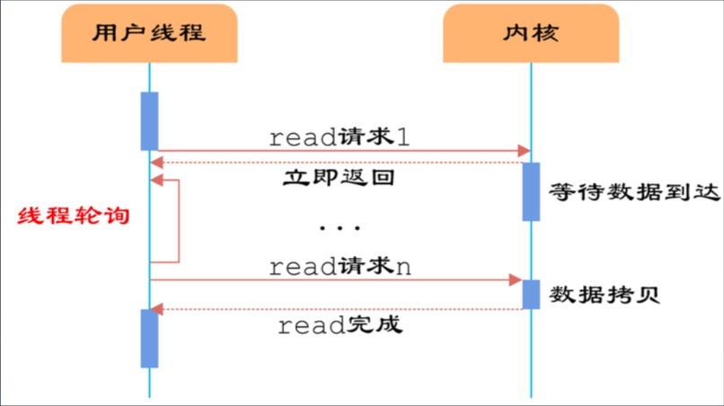

[toc]

## NIO

### 服务器通信原理

1. 通信模型

	- 

2.  HTTP 服务器 01

	- 流程

		> 1. 创建一个 ServerSocket
		> 2. 绑定端口
		> 3. 通过 accept 方法拿到 Socket，进行处理。
		> 	- Content-Length 指定内容长度
		> 4. 模拟输出
		> 5. 关闭socket

	-   idea 启动多进程时，添加　-Xmx512，设置最大堆内存。

	-  压测工具

	  - windows/mac：sb (SuperBenchmarker)

	  	> sb -u http://localhost:8001/ -c 40 -N 30

	  - linux: Apache ab / wrk

3. HTTP 服务器 02

	- 为每个客户端创建一个线程

4. HTTP 服务器 03

	- 创建一个固定大小的线程池

### 服务器通信过程分析

1.　操作分类
	1.　CPU
	2.　IO
2.　线程池大小
	1.　 线程 IO 操作时，不消耗 CPU，可以创建多于 CPU 核数的线程数量。
3.　对于一个 IO 相关应用来说，大量的 IO 会造成大部分　CPU 等资源，可能就就被浪费了。
	1.　多线程，管理成本较高。上下文切换频繁。
4.　深入一层的看问题
	1.　不仅面临线程/CPU 的问题
	2.　还要面对数据来回复制的问题。（用户空间/内核空间）

### IO 模型与相关概念

1. 阻塞、非阻塞，是线程处理模式。

2. 同步、异步，是通信模式。

3. 五种 IO 模型

	1. |      | 阻塞          | 非阻塞              |
		| ---- | ------------- | ------------------- |
		| 同步 | 阻塞 I/O 模型 | 非阻塞 I/O 模型     |
		| 同步 | I/O 复用模型  | 信号驱动的 I/O 模型 |
		| 异步 |               | 异步 I/O 模型       |

4. 阻塞 I/O 模型

  1. BIO

      -   

      -   

5. 非阻塞 I/O 模型

  1.　轮询查看数据是否准备好
  2.　类 BIO
      -   

6. I/O 多路复用模型

  1.　先阻塞在　select/poll/epoll 上，（内核轮询）
  2.　再阻塞在 IO 操作上
  3.　epoll !  ，可以看作 select/poll 的改进。
  4.　Reactor 模式
      -   

7. 信号驱动的 I/O 模型

  1.　事件驱动模式
      -   
  2.　线程池 -> EDA -> SEDA
      -   

8. 异步 I/O 模型

  1.　
  2.　Proactor 模式
      -   

### Netty 概览

0. Netty 是一个 Java 的网络应用开发框架。
1. 概览
    -   
2. 特点
  1. 异步
  2. 事件驱动
  3. 基于 NIO
3. 适用于
  1. 服务器
  2. 客户端
  3. TCP/UDP/HTTP
4. 特性
  1.　高性能协议服务器
  	1.　高吞吐
  	2.　低延迟
  	3.　低开销
  	4.　零拷贝
  	5.　可扩容
  2.　松耦合：网络和业务逻辑分离
  3.　使用方便、可维护性好
5. 应用
  1.　HTTP Server
  2.　HTTPS Server
  3.　WebSocket Server
  4.　TCP Server
  5.　UDP Server
  6.　In VM Pipe
6. 基本概念
  1.　Channel
  2.　ChannelFuture
  3.　Event & Handler
  4.　Encoder & Decoder
  5.　ChannelPipeline
7. Event & Handler
  1.　入站事件
  2.　出站事件

### Netty 原理

1. 高性能？

	1. 高并发用户
		1. QPS
		2. 业务指标
	2. 高吞吐量
		1. TPS
		2. 技术指标
	3. 低延迟
		1. 技术指标

2. 高性能的另一方面

	1. 系统复杂度　×10　以上
	2. 建设与维护成本　＋＋＋
	3. 故障或　BUG 导致的破坏性　×10　以上

3. 稳定性建议（混沌工程）

	1. 容量/现状 （自省、自知）

		> 86400s/day 
		>
		> 淘宝 TPS 3000W / 86400 ~~ 300/s
		>
		> 高并发业务：活动、秒杀

	2. 爆炸半径

	3. 工程方面积累与改进

4. Netty 运行原理

5. 关键对象

	1. Bootstrap
	2. EventLoopGroup
	3. EventLoop
	4. SocketChannel ：连接
	5. ChannelInitializer
	6. ChannelPipline
	7. ChannelHandler

6. ChannelPipline

	1. inbound
	2. outbound

7. Event & Handler

	1. 入站事件
		1. 通道激活和停用
		2. 读操作事件
		3. 异常事件
		4. 用户事件
	2. 出站事件
		1. 打开连接
		2. 关闭连接
		3. 写入数据
		4. 刷新数据

### Netty 网络优化

1. 粘包与拆包（tcp 上层）

	1.　ByteToMessageDecoder 一些常见的实现类
		1.　FixedLengthFrameDecoder

2.　Nagle　与　TCP_NODELAY

	1.　MTU，最大传输单元，1500 Byte
	2.　MSS，最大分段大小，1460 Byte
	3.　Nagle 算法优化
		1.　优化条件
			- 缓冲区满
			- 达到超时

3.　连接优化

	1.　TIME_WAIT 2MSL
		1.　降低时间
		2.　端口复用

4.　Netty 优化

	1.　不要阻塞　EventLoop

	2.　系统参数优化

		- fd 文件描述符限制

		- TIME_WAIT 2MSL

			> Linux ulimit -a /proc/sys/net/ipv4/tcp_fin_timeout
			>
			> Windows TcpTimeWaitDelay

	3.　缓冲区优化

		1.　SO_RCVBUF　接收缓冲
		2.　SO_SNDBUF　发送缓冲
		3.　SO_BACKLOG 保持连接状态
		4.　REUSEXXX

	4.　心跳周期优化

		1.　心跳机制与断线重连

	5.　内存与　ByteBuffer 优化

		1.　DirectBuffer 与　HeapBuffer

	6.　其他优化

		1.　ioRatio
		2.　Watermark
		3.　TrafficShaping

	### API 网关

	1. 职能
		1. 请求接入，所有 API　接口服务请求的接入点。
		2. 业务聚合，作为所有后端业务服务的聚合点
		3. 中介策略，实现安全、验证、路由、过滤、流控等策略
		4. 统一管理，对所有 API 服务和策略进行统一管理
	2. 分类
		1. 流量网关
			1. 关注稳定与安全
				1. 流控
				2. 日志
				3. 防SQL 注入
				4. 防 WEb 攻击
				5. 屏蔽工具
				6. 黑白 IP 名单
				7. 证书/加解密处理
		2. 业务网关
			1. 提供更好的服务
				1. 服务级别流控
				2. 服务降级与熔断
				3. 路由、LB、灰度
				4. ……

