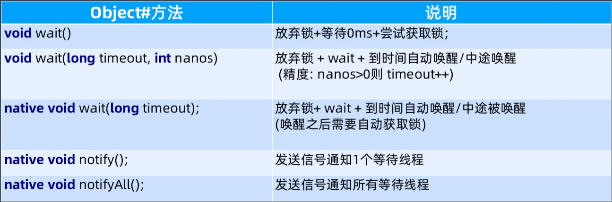
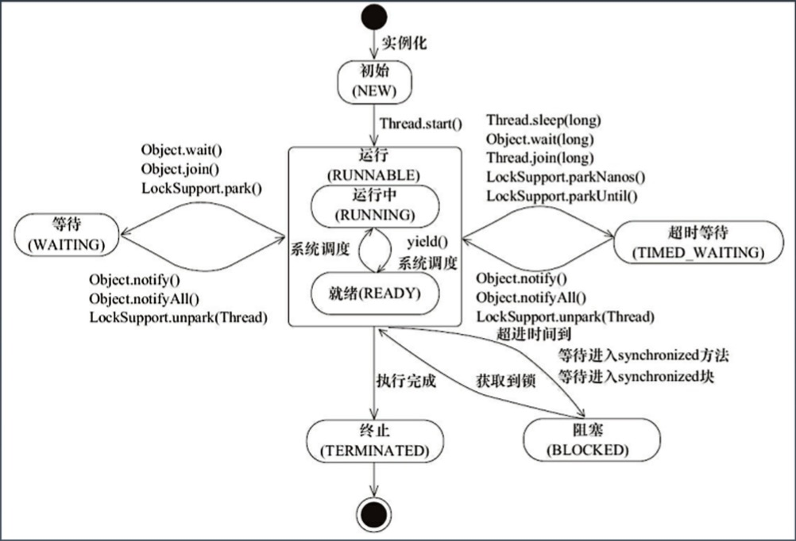

[toc]

## 并发编程

### 多线程基础

1. 起源

    - 摩尔定律失效 -> 多核＋分布式时代

        >   摩尔定律
        >
        >   性能每 18个月可以增长一倍，价格没有增长多少。
        >
        >   
        >
        >   业务需求不断增长
        >
        >   
        >
        >   --> 多核＋分布式时代

2. 多核时代的编程更有挑战

3. Java 线程的创建过程

    -   

### Java 多线程

1.   基础接口 Runnable 

     -   守护线程 setDeamon

     -   启动方式 start

     -   接口定义

         >   interface Runnable {
         >
         >   abstract void run();
         >
         >   }

     -   示例 1

         >   Runnable task = new Runnable() {
         >
         >   @Override
         >
         >   public void run() {
         >
         >   ...
         >
         >   }
         >
         >   }
         >   

     -   示例 2

         >   public class Task implements Runnable {
         >
         >   ....
         >
         >   }

     -   辨析

         >   Thread#start() 创建新线程
         >
         >   Thread#run() 本线程调用

2.   线程状态

     -   

3.   Thread 类

     -   

4.    wait & notify

     -   

     -   sleep vs wait

         >   Thread#sleep 释放 CPU
         >
         >   Object#wait 释放对象锁
     
5.   Thread 的状态改变操作

     -   Thread.sleep，线程进入　TIME_WAITING 状态
     -   Thread.yield，线程由运行状态 -> 就绪状态
     -   join，线程进入　WAITING/TIMED_WAITING 状态
     -   obj.wait，
     -   obj.notify，

6.   Thread 的中断与异常处理

     -   线程内部自己处理异常，不溢出到外层（Future 可以封装）

     -   如果线程被 wait/join/sleep 三种方法之一阻塞，此时调用该线程的 interrupt() 方法，该线程将抛出一个 InterruptException 中断异常（该线程必须事先预备处理此异常），从而提早终结被阻塞状态。

     -   如果是计算密集型的操作怎么办？

         >   分段处理，每个片段检查一下状态，是不是要终止。

7.   Thread 状态

     -   

### 线程安全

1.   多线程执行会遇到什么问题？

     -   

2.   并发相关的性质

     -   原子性

         >   这些操作是不可被中断的，要么执行，要么不执行。
         >
         >   
         >
         >   对基本数据类型的变量的读取和赋值操作是原子性操作。

     -   可见性

         >   Java 提供了 volatile 来保证可见性（volatile 并不能保证原子性）
         >
         >   当一个共享变量被 volatile 修饰时，它会保证修改的值会立即被更新到主存，当有其他线程需要读取时，它会去内存中读取新值。
         >
         >   另外，synchronized 和 Lock 也能够保证可见性。
         >
         >   它们能保证同一时刻，只有一个线程获取锁然后执行同步代码，并在释放锁之前会将对变量的修改刷新到主存中。 

     -   有序性

         >   Java 允许编译器和处理器对指令进行重排序，但，重排序过程并不会影响到单线程程序的执行，却会影响到多线程并发执行的正确性。
         >
         >   
         >
         >   可以通过 volatile/synchronized/Lock 保证一定的“有序性”
         >
         >   
         >
         >   happens-before 原则（先行发生原则）
         >
         >   1.   程序次序规则
         >   2.   锁定规则
         >   3.   Volatile 规则
         >   4.   传递规则
         >   5.   线程启动规则
         >   6.   线程中断规则
         >   7.   线程终结规则
         >   8.   对象终结规则

3.   一个例子，多线程计数

     -   class Counter

4.   synchronized 

     -   使用对象头标记字
         -   
     -   synchronized 方法优化
         -   
     -   偏向锁　BiaseLock

5.   volatile

     -   每次读取都强制从主内存刷数据
     -   适用场景：单个线程写；多个线程读
     -   原则：能不用就不用，尽量少用。不确定的时候也不用。
     -   替代方案：Atomic 原子操作类

6.   final

     -   定义

         -   

     -   思考

         >   final 声明的引用类型与原生类型在处理时有什么区别？

     -   Java 里的常量替换。写代码最大化用 final 是个好习惯。

### 线程池原理与应用

