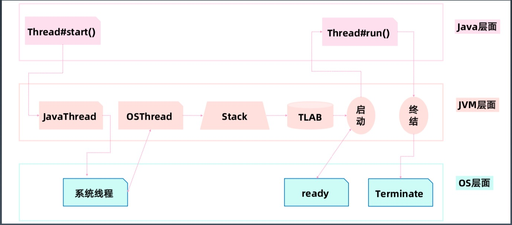
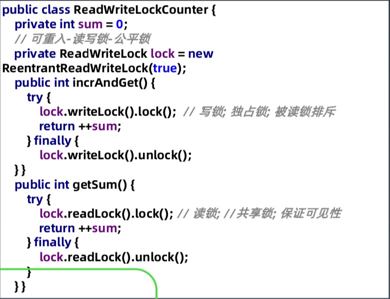
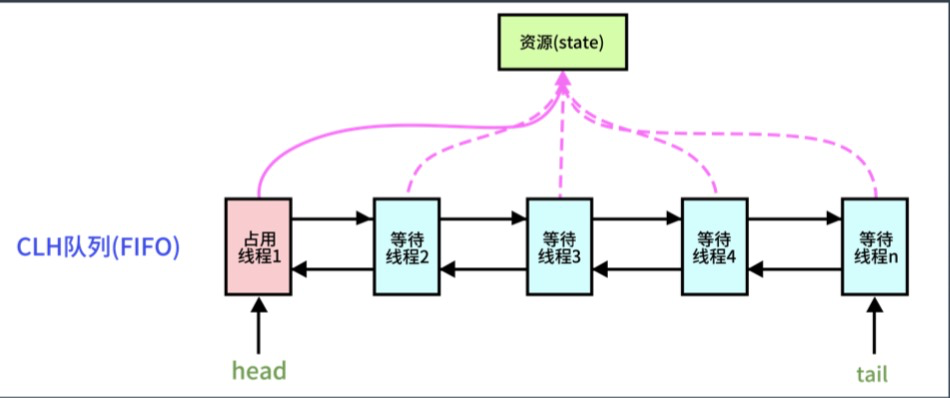
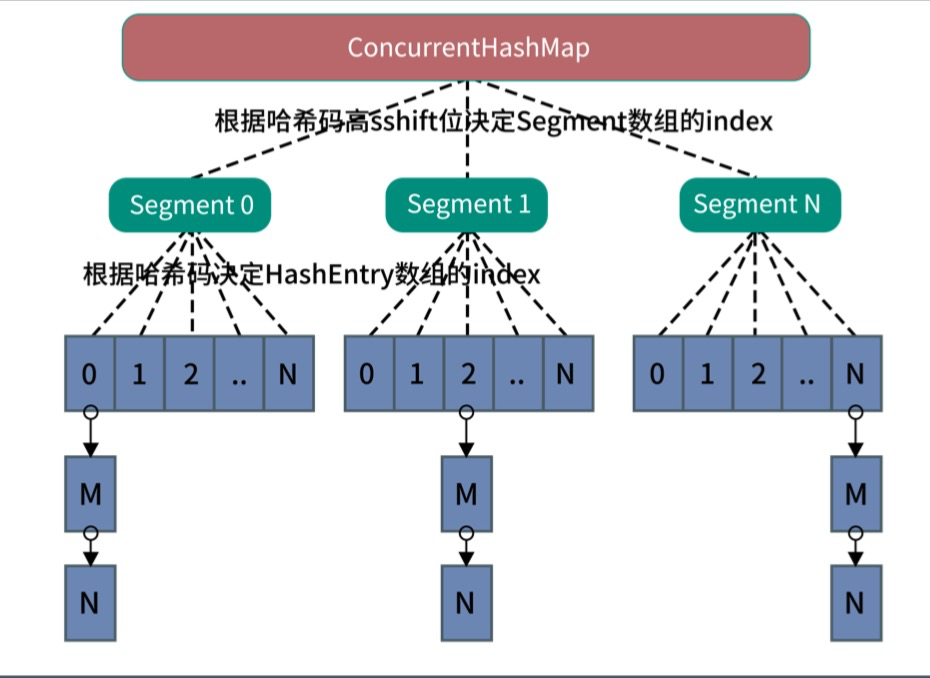

[toc]

## 并发编程

### 多线程基础

1. 起源

    - 摩尔定律失效 -> 多核＋分布式时代

        >   摩尔定律
        >
        >   性能每 18个月可以增长一倍，价格没有增长多少。
        >
        >   
        >
        >   业务需求不断增长
        >
        >   
        >
        >   --> 多核＋分布式时代

2. 多核时代的编程更有挑战

3. Java 线程的创建过程

    -   

### Java 多线程

1.   基础接口 Runnable 

     -   守护线程 setDeamon

     -   启动方式 start

     -   接口定义

         >   ```java 
         >   @FunctionalInterface
         >   public interface Runnable {
         >       /**
         >        * When an object implementing interface <code>Runnable</code> is used
         >        * to create a thread, starting the thread causes the object's
         >        * <code>run</code> method to be called in that separately executing
         >        * thread.
         >        * <p>
         >        * The general contract of the method <code>run</code> is that it may
         >        * take any action whatsoever.
         >        *
         >        * @see     java.lang.Thread#run()
         >        */
         >       public abstract void run();
         >   }
         >   ```

     -   示例 1

         >   Runnable task = new Runnable() {
         >
         >       @Override
         >
         >       public void run() {
         >
         >    ​        ...
         >
         >       }
         >
         >   }
         >

     -   示例 2

         >   public class Task implements Runnable {
         >
         >      @Override
         >
         >      public void run() {
         >
         >   ​        ...
         >
         >      }
         >
         >   }

     -   辨析

         >   Thread#start() 创建新线程
         >
         >   Thread#run() 本线程调用

2.   线程状态

     -   

3.   Thread 类

     -   

4.   wait & notify

     -   

     -   sleep vs wait

         >   Thread#sleep 释放 CPU
         >
         >   Object#wait 释放对象锁
     
5.   Thread 的状态改变操作

     -   Thread.sleep，线程进入　TIME_WAITING 状态
     -   Thread.yield，线程由运行状态 -> 就绪状态
     -   join，线程进入　WAITING/TIMED_WAITING 状态
     -   obj.wait，
     -   obj.notify，

6.   Thread 的中断与异常处理

     -   线程内部自己处理异常，不溢出到外层（Future 可以封装）

     -   如果线程被 wait/join/sleep 三种方法之一阻塞，此时调用该线程的 interrupt() 方法，该线程将抛出一个 InterruptException 中断异常（该线程必须事先预备处理此异常），从而提早终结被阻塞状态。

     -   如果是计算密集型的操作怎么办？

         >   分段处理，每个片段检查一下状态，是不是要终止。

7.   Thread 状态

     -   

### 线程安全

1.   多线程执行会遇到什么问题？

     -   

2.   并发相关的性质

     -   原子性

         >   这些操作是不可被中断的，要么执行，要么不执行。
         >
         >   
         >
         >   对基本数据类型的变量的读取和赋值操作是原子性操作。

     -   可见性

         >   Java 提供了 volatile 来保证可见性（volatile 并不能保证原子性）
         >
         >   当一个共享变量被 volatile 修饰时，它会保证修改的值会立即被更新到主存，当有其他线程需要读取时，它会去内存中读取新值。
         >
         >   另外，synchronized 和 Lock 也能够保证可见性。
         >
         >   它们能保证同一时刻，只有一个线程获取锁然后执行同步代码，并在释放锁之前会将对变量的修改刷新到主存中。 

     -   有序性

         >   Java 允许编译器和处理器对指令进行重排序，但，重排序过程并不会影响到单线程程序的执行，却会影响到多线程并发执行的正确性。
         >
         >   
         >
         >   可以通过 volatile/synchronized/Lock 保证一定的“有序性”
         >
         >   
         >
         >   happens-before 原则（先行发生原则）
         >
         >   1.   程序次序规则
         >   2.   锁定规则
         >   3.   Volatile 规则
         >   4.   传递规则
         >   5.   线程启动规则
         >   6.   线程中断规则
         >   7.   线程终结规则
         >   8.   对象终结规则

3.   一个例子，多线程计数

     -   class Counter

4.   synchronized 

     -   使用对象头标记字
         -   
     -   synchronized 方法优化
         -   
     -   偏向锁　BiaseLock

5.   volatile

     -   每次读取都强制从主内存刷数据
     -   适用场景：单个线程写；多个线程读
     -   原则：能不用就不用，尽量少用。不确定的时候也不用。
     -   替代方案：Atomic 原子操作类

6.   final

     -   定义

         -   

     -   思考

         >   final 声明的引用类型与原生类型在处理时有什么区别？

     -   Java 里的常量替换。写代码最大化用 final 是个好习惯。

### 线程池原理与应用

1.   线程池

     -   Excutor 执行者，顶层接口
     -   ExcutorService 接口 API
     -   ThreadFactory 线程工厂
     -   ThreadPoolExector
     -   Excutors 工具类，创建线程

2.   Excutor

     -   方法

         -   

     -   结构

         -   

     -   submit vs execte

         >   submit 方法 -> 有返回值，用 Future 封装 
         >
         >   execute 方法 -> 无返回值
         >
         >   
         >
         >   submit 方法还异常可以在主线程中 get 捕获到 
         >
         >   execute 方法执行任务是捕捉不到异常的

3.   ExecutorService

     -   方法

         -   

     -   停止方法 vs

         >   shutdown(): 停止接收新任务，原来的任务继续执行
         >
         >   shutdownNow(): 停止接收新任务，原来的任务停止执行
         >
         >   boolean awaitTermination(timeOut, unit): 阻塞当前线程，返回是否线程都执行完
     
4.   ThreadPoolExecutor

     -   提交任务逻辑

         -   

     -   理解

         >   1.   判断 corePoolSize
         >   2.   加入 workQueue
         >   3.   判断 maximumPoolSize
         >   4.   执行拒绝策略处理器

5.   线程池参数

     -   缓冲队列，BlockingQueue 是双缓冲队列。

         -   ArrayBlockingQueue

             >   规定大小
             >
             >   FIFO

         -   LinkedBlockingQueue

             >   不固定大小，建议指定大小。
             >
             >   FIFO

         -   PriorityBlockingQueue

             >   类似LinkedBlockingQueue
             >
             >   顺序依据对象的自然顺序或构造函数的 Comparator 决定

         -   SynchronizedQueue

             >   特殊的 BlockingQueue 对其操作必须是放和取交替完成。
         
     -   拒绝策略

         -   ThreadPoolExecutor.AbortPolicy（常用）

             >   丢弃任务 & RejectedExecutionException

         -   ThreadPoolExecutor.DiscardPolicy

             >   丢弃任务

         -   ThreadPoolExecutor.DiscardOldestPolicy

             >   丢弃队列最前面的任务

         -   ThreadPoolExecutor.CallerRunsPolicy（最常用）

             >   由调用线程（提交任务的线程）处理该任务

6.   ThreadFactory

     -   代码

         -   ```java
             public class CustomThreadFactory implements ThreadFactory {
                 private AtomicInteger serial = new AtomicInteger(0);
             
                 @Override
                 public Thread newThread(Runnable r) {
                     Thread thread = new Thread(r);
                     thread.setDaemon(true); // 根据需要，设置守护线程
                     thread.setName("CustomeThread-" + serial.getAndIncrement());
                     return thread;
                 }
             }
             ```

7.   ThreadPoolExecutor

     -   属性 & 方法
         -   
     -   示例，创建线程池
         -   

8.   创建线程池方法

     -   newSingleThreadExecutor

         >   创建一个单线程的线程池

     -   newFixedThreadPool

         >   创建固定大小的线程池

     -   newCachedThreadPool

         >   创建一个可缓存的线程池

     -   newScheduledThreadPool

         >   创建一个大小无限的线程池
         >
         >   定时&周期性执行任务

9.   经验，固定线程池大小设置（核心数为 N）

     -   CPU 密集型，N 或 N +1 
     -   IO 密集型，2N 或 2N + 2

10.  Callable - 基础接口

     -   方法

         -   

     -   示例

         -   ```java
             public class RandomSleepTask implements Callable<Integer> {
                 @Override
                 public Integer call() throws Exception {
                     Integer sleep = new Random().nextInt(10000);
                     TimeUnit.MILLISECONDS.sleep(sleep);
                     return sleep;
                 }
             }
             ```

         -   

     -   Runnable vs Callable

         >   Runnable#run() 没有返回值
         >
         >   Callable#call() 有返回值

11.   Future - 基础接口

      -   方法

          -   

      -   示例

          -   ```java
              public static void main(String[] args) throws Exception {
                  Callable<Integer> task = new RandomSleepTask();
                  ExecutorService executorService = initThreadPoolExecutor();
                  Future<Integer> future1 = executorService.submit(task);
                  Future<Integer> future2 = executorService.submit(task); // 等待执行结果
                  Integer result1 = future1.get(1, TimeUnit.SECONDS);
                  Integer result2 = future2.get(1, TimeUnit.SECONDS);
                  System.out.println("result1=" + result1);
                  System.out.println("result2=" + result2);
              }
              ```


### Java 并发包（JUC，java.util.concurrency）

1.   JDK 核心库
     -   
2.   java.util.concurrency 分类

     -   
     -   锁机制类 Locks : Lock, Condition, ReentrantLock, ReadWriteLock,LockSupport 
     -   原子操作类 Atomic : AtomicInteger, AtomicLong, LongAdder
     -   线程池相关类 Executor : Future, Callable, Executor, ExecutorService 
     -   信号量三组工具类 Tools : CountDownLatch, CyclicBarrier, Semaphore 
     -   并发集合类 Collections : CopyOnWriteArrayList, ConcurrentMap

### 什么是锁

1.   为什么需要显式 Lock

     -   synchronized 方式的问题

         >   同步块的阻塞无法中断(不能 Interruptibly) 
         >
         >   同步块的阻塞无法控制超时(无法自动解锁) 
         >
         >   同步块无法异步处理锁(即不能立即知道是否可以拿到锁) 
         >
         >   同步块无法根据条件灵活的加锁解锁(即只能跟同步块范围一致)
     
2.   Lock

     -   优点

         >   使用方式灵活可控
         >   
         >   性能开销小
         >   
         >   锁工具包: java.util.concurrent.locks
         >   

     -   接口设计

         >   // 1.支持中断的 API
         >
         >   void lockInterruptibly() throws InterruptedException;
         >
         >   // 2.支持超时的 API
         >
         >   boolean tryLock(long time, TimeUnit unit) throws InterruptedException; 
         >
         >   // 3.支持非阻塞获取锁的 API
         >
         >   boolean tryLock();
         
     -   基础接口

         -   

     -   示例

         -   

     -   思考

         >   可重入锁：第二次进入时是否阻塞
         >
         >   公平锁：公平锁意味着排队靠前的优先
     
3.   ReadWriteLock 读写锁

     -   方法

         -   

     -   示例

         -   

     -   适用场景

         >   ReadWriteLock 适用于读多写少的并发情况。

4.   Condition

     -   方法

         -   

     -   使用

         >   通过 Lock.newCondition() 创建。
         >
         >   可以看做是 Lock 对象上的信号。类似于 wait/notify。

5.   LockSupport -- 锁当前线程

     -   方法
         -   

6.   最佳实践

     -   Doug Lea《Java 并发编程:设计原则与模式》

         >   1. 永远只在更新对象的成员变量时加锁
         >   2. 永远只在访问可变的成员变量时加锁
         >   3. 永远不在调用其他对象的方法时加锁
         >   
         
     -   KK 总结-最小使用锁

         >   1. 降低锁范围:锁定代码的范围/作用域 
         >   
         >   2. 细分锁粒度:讲一个大锁，拆分成多个小锁
         >   

### 并发原子类

1.   Atomic 工具类

     -   java.util.concurrent.atomic
         -   
     -   示例
         -   

2.   无锁技术

     -   底层原理

         >   Unsafe API - CompareAndSwap 
         >
         >   CPU 硬件指令支持 - CAS 指令
         >
         >   Value 的可见性 - volatile 关键字
         
     -   cas + volatile 实现原理

         >   volatile 保证读写操作都可见(注意不保证原子); 
         >
         >   使用 CAS 指令，作为乐观锁实现，通过自旋重试保证写入。
     
3.   无锁 vs 锁

     -   并发跟锁性能的关系

         >   压力非常小，性能本身要求就不高;  －－　无所谓加不加锁
         >
         >   压力一般的情况下，无锁更快，大部分都一次写入; 　－－　乐观锁
         >
         >   压力非常大时，自旋导致重试过多，资源消耗很大。　－－　悲观锁
     
4.   LongAdder 对 AtomicLong 的改进

     -   分段思想/多路归并

         >   AtomicInteger 和 AtomicLong 里的 value 是所有 线程竞争读写的热点数据;
         >   
         >   将单个 value 拆分成跟线程一样多的数组 Cell[]; 
         >   
         >   每个线程写自己的 Cell[i]++，最后对数组求和。
         >   

### 并发工具类

1.   更复杂的应用场景

     >   我们需要控制实际并发访问资源的并发**数量**
     >
     >   我们需要多个线程在某个**时间**同时开始运行
     >
     >   我们需要指定数量线程到达某个**状态**再继续处理
     
2.   AQS

     -   AbstractQueuedSynchronizer，即队列同步器。
     -   它是构建锁或者其他同步组件的基础 (如 Semaphore、CountDownLatch、ReentrantLock、ReentrantReadWriteLock)。是 JUC 并发包中的核心基础组件，**抽象了竞争的资源和线程队列**。
     -   AbstractQueuedSynchronizer:　抽象队列式的同步器
         -   
     -   两种资源共享方式: **独占 | 共享**，子类负责实现 **公平 | 非公平**

3.   Samaphore - 信号量

4.   CountdownLatch 

     -   方法
         -   
     -   流程
         -   
     -   原理
         -   阻塞主线程，N 个子线程满足条件时主线程继续。
     -   场景
         -   Master 线程等待 Worker 线程把任务执行完
     -   示例
         -   

5.   CyclicBarrier

     -   方法
         -   
     -   示例
         -   
     -   流程
         -   
     -   场景
         -   任务执行到一定阶段, 等待其他任务对齐，阻塞 N 个线程时所有线程被唤醒继续。

6.   CountdownLatch vs CyclicBarrier

     -   方法
         -   
     -   流程
         -   

7.   Future/FutureTask/CompletableFuture

     -   Future
         -   
     -   complatableFuture
         -   
     -   complatableFuture 方法
         -   
     -   示例
         -   

### 线程安全类型/并发编程

1.   常用的线程安全类型

     -   分类
         -   原生类型
         -   数组类型
         -   对象引用类型
     -   java.util 
         -   线性数据结构，源于 Collection 接口
             -   List: ArrayList、LinkedList、Vector、Stack 
             -   Set: LinkedSet、HashSet、TreeSet 
             -   Queue->Deque->LinkedList
         -   K/V
             -   Map: HashMap、LinkedHashMap、TreeMap 
             -   Dictionary->HashTable->Properties

2.   ArrayList

     -   基本特点: 基于数组，便于按 index 访问，超过数组需要扩容，扩容成本较高 

     -   用途: 大部分情况下操作一组数据都可以用 ArrayList

     -   原理: 使用数组模拟列表，默认大小10，扩容 x1.5，newCapacity = oldCapacity + (oldCapacity >> 1)

     -   安全问题

         -   写冲突

         -   读写冲突

             >   读，特别是 iterator
             >
             >   ConcurrentModificationException

3.   LinkedList

     -   基本特点: 使用链表实现，无需扩容
     -   用途: 不知道容量，插入变动多的情况
     -   原理: 使用双向指针将所有节点连起来
     -   安全问题
         -   写冲突
         -   读写冲突

4.   List 线程安全

     -   读写都加锁（不太推荐）

         >   ArrayList + synchronized -> Vector
         >
         >   Collectionis.synchronizedlist，强制将 List 加上同步
         >
         >   Arrays.asList，不允许添加、删除，但可以 set 
         >
         >   Collectionis.unmodifiableList，不允许修改、删除、set

     -   CopyOnWriteArrayList

         -   核心改进原理

             >   写加锁，保证不会写混乱
             >
             >   写在一个 Copy 副本上，而不是原始数据上（GC Young 区用复制，old 区用本区内的移动）
             >
             >   读写分离，最终一致

         -   流程

             -   

5.   HashMap

     -   基本特点: **空间换时间**，哈希冲突不大的情况下查找数据性能很高 
     -   用途: 存放指定 key 的对象，缓存对象
     -   原理: 使用 hash 原理，存 k-v 数据，初始容量16，扩容x2，负载因子0.75。JDK8 以后，在链表长度到8 & 数组长度到64时，使用红黑树
     -   安全问题
         -   写冲突 
         -   读写问题，可能会死循环 
         -   keys()无序问题

6.   LinkedHashMap

     -   基本特点: 继承自 HashMap，对 Entry 集合添加了一个双向链表 
     -   用途: 保证**有序**，特别是 Java8 stream 操作的 toMap 时使用 
     -   原理: 同  LinkedList，包括**插入顺序和访问顺序**
     -   安全问题:
         -   同 HashMap
     
7.   ConcurrentHashMap-Java7 分段锁

     -   结构
         -   

     -   分段锁
         -   默认16个 Segment，降低锁粒度。 concurrentLevel = 16
     -   **ConcurrentHashMap-Java7** 分段锁
         -   

8.   ConcurrentHashMap-Java8

     -   结构
         -   
     -   CAS ＋ 红黑树
         -   

9.   ConcurrentHashMap-Java7 vs ConcurrentHashMap-Java8

     -   Java 7 为实现并行访问，引入了 Segment 这一结构，实现了分段锁，理论上最大并 发度与 Segment 个数相等。
     -   Java 8 为进一步提高并发性，摒弃了分段 锁的方案，而是直接使用一个大的数组。

10.  并发集合类总结

     -   

### 并发经验总结

1.   ThreadLocal -- 线程安全操作利器

     -   方法
         -   

2.   并行 Stream

3.   伪并发问题

     -   浏览器端，表单的重复提交问题

         >   服务器端，给每个表单生成一个随机编号。提交时判断重复。

4.   分布式下的锁和计数器

     -   《后面章节讲》

5.   加锁需要考虑的问题

     >   粒度
     >
     >   性能
     >
     >   重入
     >
     >   公平
     >
     >   自旋锁（CAS）
     >
     >   场景：脱离场景谈性能都是耍流氓

6.   线程间协作与通信

     -   共享

         >   static/实例变量（堆内存）	
         >
         >   Lock
         >
         >   synchronized

     -   协作

         >Thread#join()
         >
         >Object#wait/notify/notifyAll
         >
         >Future/Callable
         >
         >CountdownLatch
         >
         >CyclicBarrier

