[toc]

## Java 相关框架

### Spring 技术发展

1.   Spring

     >   Spring makes Java simple

2.   Spring Boot

     >   Build Anything

3.   Spring Cloud

     >   Coordinate Anything

4.   Spring Cloud Data Flow

     >   Connect Everything

### Spring 框架设计

1.   框架是基于一组类库或工具，在特定领域里根据一定的规则组合成的、开放性的骨架。

2.   特性

     -   支撑性+扩展性
     -   聚合性+约束性

3.   Spring Framework

     -   常用

         >   1.   Core: Bean/Context/AOP
         >
         >   2.   Testing: Mock/TestContext
         >
         >   3.   DataAccess: Tx/JDBC/ORM
         >
         >   4.   Spring MVN/WebFlux: web

     -   不常用

         >   5.   Integration: remoting/JMS/WS
         >
         >   6.   Languages: Kotlin/Groovy

4.   Spring 框架设计

     -   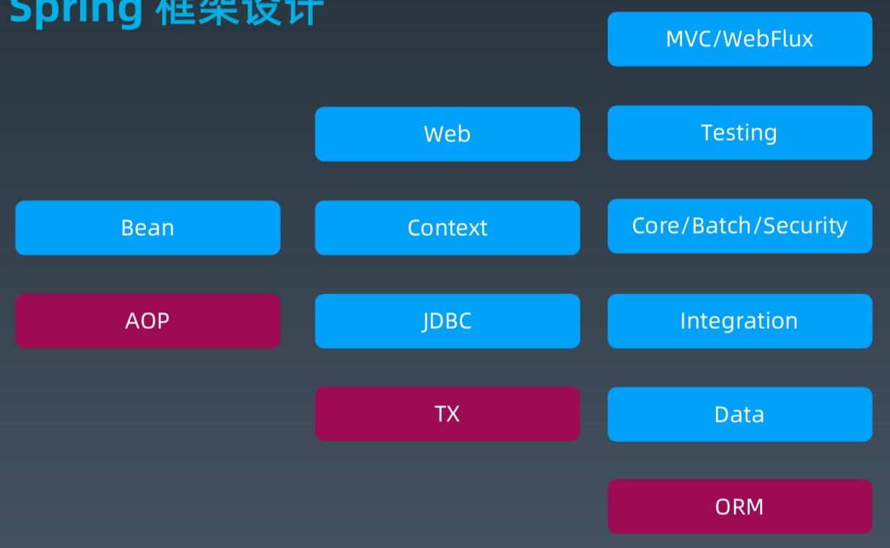

5.   Spring 研发协作模式

     -   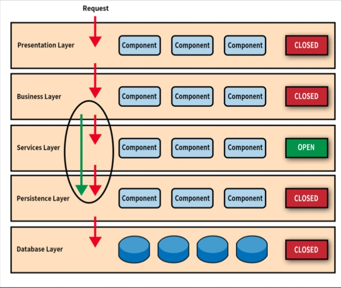

### Spring AOP 详解

1.   AOP - 面向切面编程

     -   Spring 早期版本的核心功能

         >   管理对象生命周期与对象装配

     -   增加一个中间层代理来实现所有对象的托管。 

2.   IoC - 控制反转

     -   DI（Dependency Injection），依赖注入。对象装配思路的改进。

3.   循环依赖

     -   Spring 可以解压循环依赖的问题
     -   构造器中的循环依赖（死锁），Spring / Java 是没法解决的。

4.   Spring AOP 

     -   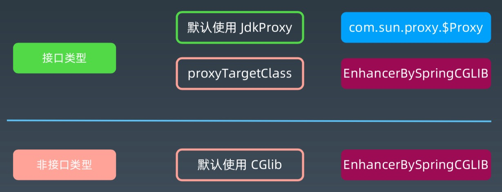

5.   AOP-面向切面编程，示例

6.   AOP 实现

     -   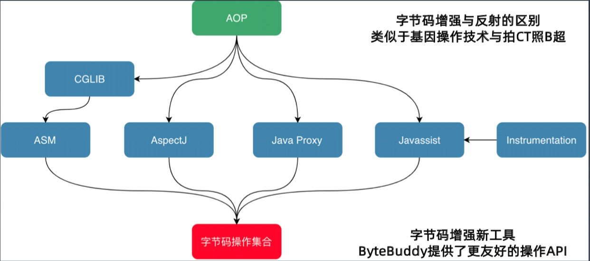

### Spring Bean 核心原理

1.   Bean 的加载过程
     -   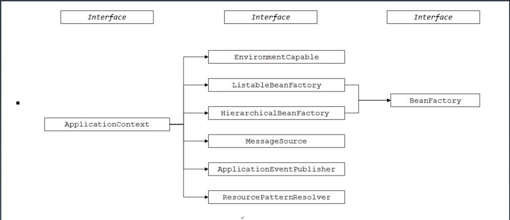
     -   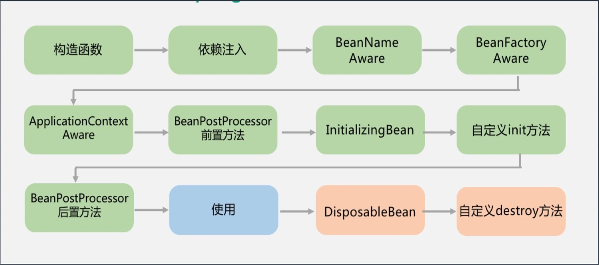
     -   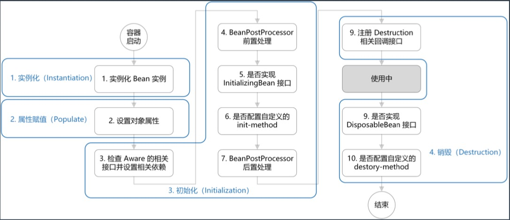
2.   Bean 的加载过程 -- 代码层面
     -   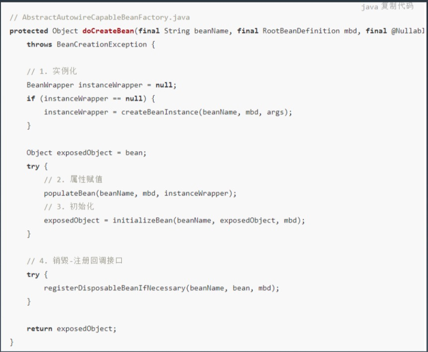
     -   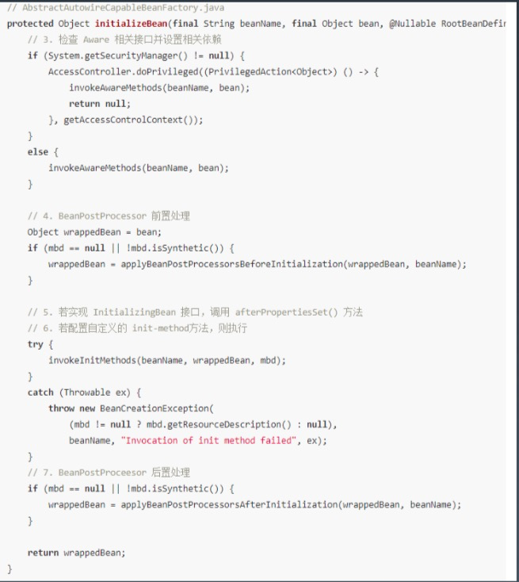
3.   Bean 的加载过程
     -   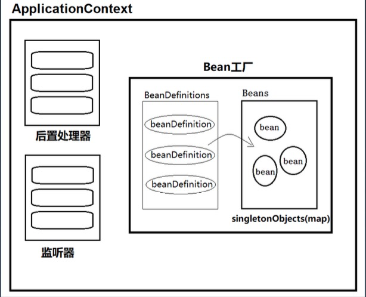
4.   Spring 编程、协作模式
     -   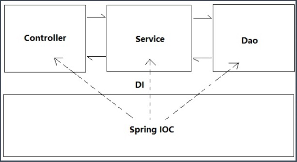
5.   示例

### Spring XML 配置原理

1.   XML 配置原理
     -   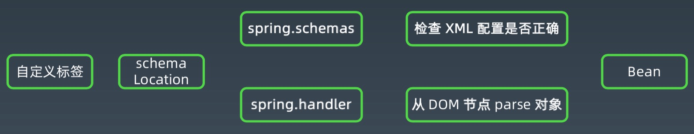
2.   自动化 XML 配置工具：XmlBeans -> Spring-xbean
     -   原理
         -   根据Bean的字段结构，自动生成XSD 
         -   根据Bean的字段结构，加载XML文件
3.   Spring Bean 配置方式演化
     -   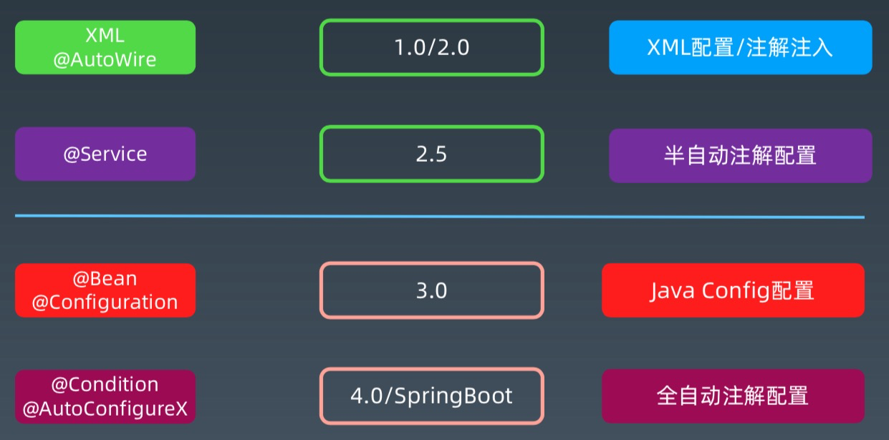

### Spring Messaging

1.   同步消息 RPC
     -   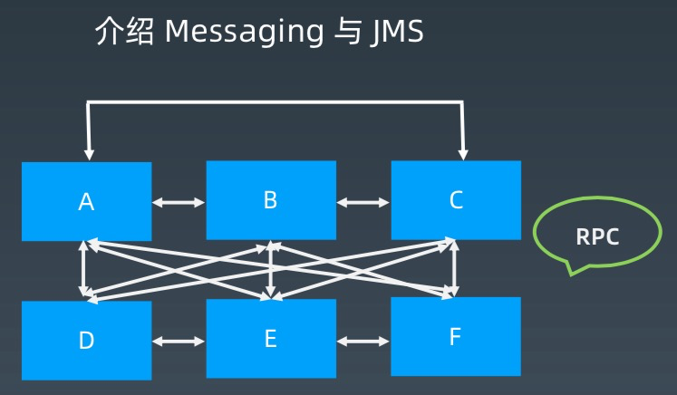
2.   异步消息 MQ
     -   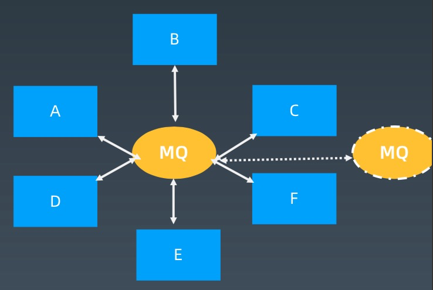
3.   生产－消费 Queue
     -   
4.   发布－订阅 Topic
     -   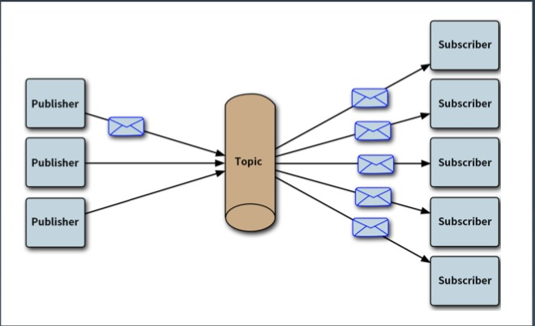
5.   示例
     -    

### Spring -> Spring Boot

1.   Spring 配置的发展方向

     -   XML-- 全局
     -   注解　－－　类
     -   配置类　－－　方法
     -   Spring  4　以上的特性，走向Spring Boot

2.   Spring Boot 的出发点

     -   Spring 臃肿以后的必然选择
         -   一切为了简化
         -   让开发变简单
         -   让配置变简单
         -   让运行变简单
     -   怎么变简单？
         -   整合
         -   原则：约定大于配置

3.   Spring Boot 如何做到简化？

     -   Spring 本身技术的成熟与完善，各方面第三方组件的成熟集成 
     -   Spring 团队在去 web 容器化等方面的努力
     -   基于 MAVEN 与 POM 的 Java 生态体系，整合 POM 模板成为可能 
     -   避免大量 maven 导入和各种版本冲突

4.   什么是 Spring Boot

     -   Spring Boot 是 Spring 的一套快速配置脚手架，关注于自动配置，配置驱动。

     -   定义

         >   Spring Boot 使创建独立运行、生产级别的 Spring 应用变得容易，你可以直接运行它。
         >
         >   我们对 Spring 平台和第三方库采用限定性视角，以此让大家能在最小的成本下上手。
         >
         >   大部分 Spring Boot 应用仅仅需要最少量的配置。

     -   功能特性

         >   创建独立运行的 Spring 应用
         >   
         >   直接嵌入 Tomcat 或 Jetty，Undertow，无需部署 WAR 包
         >   
         >   提供限定性的 starter 依赖简化配置(就是脚手架)
         >   
         >   在必要时自动化配置 Spring 和其他三方依赖库
         >   
         >   提供生产 production-ready 特性，例如指标度量，健康检查，外部配置等 
         >   
         >   完全零代码生产和不需要 XML 配置
         >   

5.   快速构建基于 maven 项目

### Spring Boot 核心原理

1.   自动化配置: 简化配置核心 基于 Configuration，EnableXX，Condition

2.   spring-boot-starter: 脚手架核心 整合各种第三方类库，协同工具

3.   配置　-> starter

     -   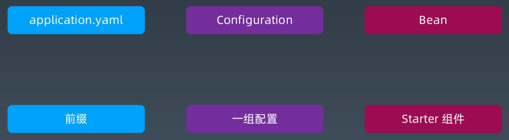

4.   约定大于配置

     -   优点：开箱即用　

     -   默认约定

         >   Maven 的目录结构:　默认有 resources 文件夹存放配置文件。默认打包方式为 jar。 
         >
         >   默认的配置文件:　application.properties 或 application.yml 文件
         >
         >   默认通过 spring.profiles.active 属性来决定运行环境时的配置文件。 
         >
         >   EnableAutoConfiguration 默认对于依赖的 starter 进行自动装载。
         >
         >   spring-boot-start-web 中默认包含 spring-mvc 相关依赖以及内置的 
         >   web 容器，使得构建 一个 web 应用更加简单。
     
5.   自动化配置原理

     -   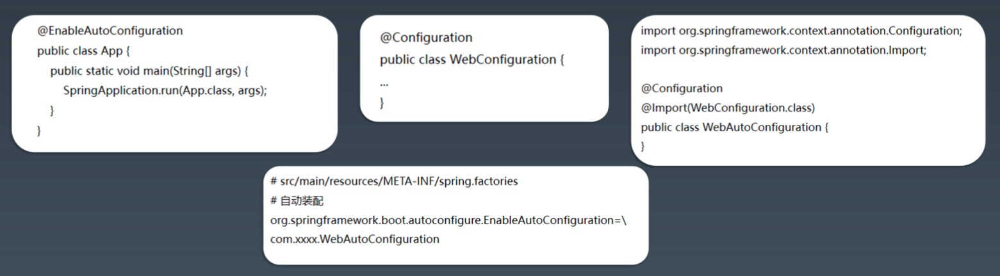

6.   Spring Boot 自动配置注解

     -   @SpringBootApplication
     -   @SpringBootConfiguration
     -   @EnableAutoConfiguration
     -   @AutoConfigurationPackage
     -   @Import({AutoConfigurationImportSelector.class})

7.   条件化自动配置

     -   @ConditionalOnBean 
     -   @ConditionalOnClass 
     -   @ConditionalOnMissingBean 
     -   @ConditionalOnProperty 
     -   @ConditionalOnResource 
     -   @ConditionalOnSingleCandidate 
     -   @ConditionalOnWebApplication

### Spring Boot Starter

1.   starter 所需要配置文件
     -   spring.provides 
     -   spring.factories 
     -   additional-xxxx-metadata 
     -   自定义 Configuration 类
2.   示例
     -   `shardingsphere -> shardingsphere-jdbc-core-spring-boot-starter`

### JDBC / 数据库连接池

1.   JDBC 定义了数据库交互接口：
     -   DriverManager
     -   Connection
     -   Statement
     -   ResultSet 
     -   DataSource--Pool
2.   JDBC - Java 操作数据库的核心
     -   Java 操作数据库的各种类库，都可以看做是在 JDBC 上做的增强实现
3.   数据库连接池
     -   C3P0
     -   DBCP--Apache CommonPool 
     -   Druid
     -   Hikari（推荐）

### ORM -- Hibernate / MyBatis

0.   ORM 
     -   实现 Java Obj -> SQL 的转换

1.   Hibernate
     -    国际使用最多

2.   MyBatis
     -   国内使用最多

     -   半自动化的 ORM

         >   映射文件　mapper.xml　定义 map 规则和 SQL
         >
         >   定义　mapper/DAO ，基于 xml 规则，操作数据库

3.   Hibernate vs MyBatis

     -   Mybatis 优点: 原生SQL(XML 语法)，直观，对 DBA 友好

         >   对 DBA友好
         >
         >   对性能调优友好
         >
         >   对 SQL 审计友好

     -   Hibernate 优点: 简单场景不用写 SQL(HQL、Cretiria、SQL)

     -   Mybatis 缺点: 繁琐，可以用 MyBatis-generator、MyBatis-Plus 之类的插件

     -   Hibernate 缺点: 对DBA 不友好

### Spring / Spring Boot 集成 ORM / JPA

1.   JPA

     -   全称 Java Persistence API

         >   即 Java 持久化 API，是一套基于 ORM 的规范，内部是由一系列的接口和抽象类构成。

     -   核心 EntityManager

2.   Spring JDBC vs ORM

     -   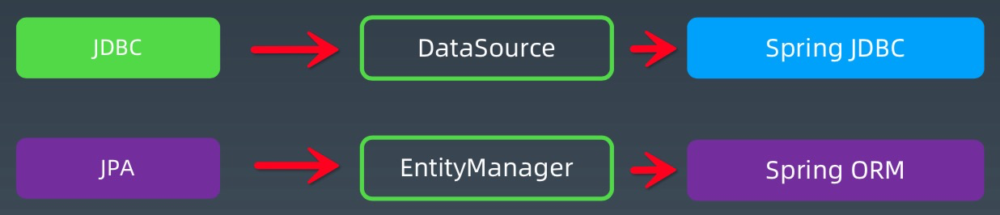

3.   Spring 管理事务

     -   JDBC 

         >   编程式事务管理

     -   Spring 

         >   声明式事务管理:事务管理器+AOP

     -   Spring 声明式事务配置参考

         >   事务的传播性:
         >
         >   @Transactional(propagation=Propagation.REQUIRED)
         >
         >   
         >
         >   事务的隔离级别:
         >
         >   @Transactional(isolation = Isolation.READ_UNCOMMITTED) 
         >
         >   读取未提交数据(会出现脏读，不可重复读) 基本不使用
         >
         >   
         >
         >   只读:
         >
         >   @Transactional(readOnly=true)
         >   该属性用于设置当前事务是否为只读事务，设置为 true 表示只读，false 则表示可读写，默认值为 false。 
         >
         >   
         >
         >   事务的超时性:
         >
         >   @Transactional(timeout=30)
         >
         >   
         >
         >   回滚:
         >
         >   指定单一异常类:@Transactional(rollbackFor=RuntimeException.class) 
         >
         >   指定多个异常类:@Transactional(rollbackFor={RuntimeException.class, Exception.class})
     
4.   示例

     -   `shardingsphere -> examples`
     -   Spring 集成 MyBatis
     -   Spring 集成 Hibernate/JPA
     -   Spring Boot 集成 JPA/Hibernate
     -   Spring Boot 集成 MyBatis

5.   Spring/Spring Boot 使用 ORM 的经验

     -   本地事务(事务的设计与坑) 
     -   多数据源(配置、静态制定、动态切换) 
     -   数据库连接池池配置(大小、重连、超时) 
     -   ORM 内的复杂 SQL，级联查询
     -   ORM 辅助工具和插件

### Java8 Lambda*

1.   Lambda 表达式

     -   是一个匿名函数，即没有函数名的函数。
     -   从动态引用到动态定义，简化 Java 函数写法
     -   Java 面向对象 -> Lambda 面向函数。

2.   语法格式

     >   `(parameters) -> expression`
     >
     >   `(parameters) ->{ statements; }`
     >
     >   
     >
     >   // 1. 不需要参数,返回值为 5
     >
     >   `() -> 5`
     >
     >   
     >
     >   // 2. 接收一个参数(数字类型),返回其2倍的值 
     >
     >   `x -> 2 * x`
     >
     >   
     >
     >   // 3. 接受2个参数(数字),并返回他们的差值 
     >
     >   `(x, y) -> x – y`
     >
     >   
     >
     >   // 4. 接收2个int型整数,返回他们的和 
     >
     >   `(int x, int y) -> x + y`
     >
     >   
     >
     >   // 5. 接受一个 string 对象,并在控制台打印,不返回任何值(看起来像是返回void) 
     >
     >   `(String s) -> System.out.print(s)`
     
3.   深入 Java8 函数式

     -   @FunctionalInterface
     -   Predicate<T> 有参数、条件判断 
     -   Function<T, R> 有参数、有返回值
     -   Consumer<T> 无返回值 
     -   Supplier<T> 无参数、有返回值
     -   能否进一步简化:方法引用

### Java8 Stream*

1.   Java 泛型

     -   伪泛型，擦除法
     -   泛型是为了简化编程

2.   流

     -   定义

         >   Stream(流)是一个来自**数据源**的**元素**队列并支持**聚合操作**
         >
         >   
         >
         >   元素: 特定类型的对象，形成一个队列。 Java 中的 Stream 并不会存储元素，而是按需计算。
         >
         >   数据源: 流的来源。可以是集合，数组，I/O channel，产生器 generator 等。
         >
         >   聚合操作: 类似 SQL 语句一样的操作，比如 filter, map, reduce, find, match, sorted 等。

     -   Stream vs Collection

         >   **Pipelining**: 中间操作都会返回流对象本身。
         >
         >   这样多个操作可以串联成一个管道，如同流式风格(fluent style)。这样做可以对操作进行优化，比如延迟执行(laziness)和短路(short-circuiting)。
         >
         >   
         >
         >   **内部迭代**: 以前对集合遍历都是通过 Iterator 或者 For-Each 的方式，显式的在集合外部进行迭代，这叫做外 部迭代。
         >
         >   Stream 提供了内部迭代的方式，通过访问者模式(Visitor)实现。

3.   Stream 操作

     -   中间操作

         1.   选择与过滤

              >   filter(Predicate p) －－　接收 Lambda ， 从流中排除某些元素。
              >
              >   distinct() －－　筛选，通过流所生成元素的 hashCode() 和 equals() 去除重复元素。
              >
              >   limit(long maxSize) －－　截断流，使其元素不超过给定数量。
              >
              >   skip(long n) －－　跳过元素，返回一个扔掉了前 n 个元素的流。若流中元素不足 n 个，则返回一个空流

         2.   映射

              >   map(Function f) －－　接收 Lambda ， 将元素转换成其他形式或提取信息;接收一个函数作为参数，该函数会被应用到每个元素上，并将其映射成一个新的元素。
              >
              >   mapToDouble(ToDoubleFunction f) －－　接收一个函数作为参数，该函数会被应用到每个元素上，产生一个新的 DoubleStream。
              >
              >   mapToInt(ToIntFunction f) －－　接收一个函数作为参数，该函数会被应用到每个元素上，产生一个新的IntStream。
              >
              >   mapToLong(ToLongFunction f) －－　接收一个函数作为参数，该函数会被应用到每个元素上，产生一个新的 LongStream。
              >
              >   flatMap(Function f) －－　接收一个函数作为参数，将流中的每个值都换成另一个流，然后把所有流连接 成一个流。

         3.   排序

              >   sorted() －－　产生一个新流，其中按自然顺序排序
              >
              >   sorted(Comparator comp) －－　产生一个新流，其中按比较器顺序排序

     -   终止操作

         1.   查找与匹配

              >   allMatch——检查是否匹配所有元素 
              >
              >   anyMatch——检查是否至少匹配一个元素 
              >
              >   noneMatch——检查是否没有匹配的元素 findFirst——返回第一个元素 
              >
              >   findAny——返回当前流中的任意元素 count——返回流中元素的总个数 
              >
              >   max——返回流中最大值 min——返回流中最小值

         2.   归约

              >   reduce，需要初始值（类比 MapReduce）

         3.   收集 collect

              >   toList List<T> －－　把流中元素收集到 List
              >
              >   toSet Set<T> －－　把流中元素收集到 Set
              >
              >   toCollection Collection<T> －－　把流中元素收集到创建的集合 
              >
              >   count －－　计算流中元素的个数
              >
              >   summaryStatistics －－　统计最大最小平均值

         4.   迭代 forEach

### Lombok

### Guava

### 设计原则*

### 设计模式*

### 单元测试*

