[toc]

## 系统性能优化

### 性能优化

1.   性能
     -   吞吐与延迟
     -   量化
     -   20/80 原则
     -   过早优化是万恶之源
     -   脱离场景谈性能都是耍流氓
2.   业务系统性能优化的核心 -- DB/SQL 优化
     -   业务分类
         -   计算密集型
         -   数据密集型
     -   一般来说，DB/SQL 操作的消耗在一次处理中占比最大
     -   业务系统发展的不同阶段和时期，性能瓶颈要点不同。

### 关系数据库 MySQL

### 深入数据库原理

1.   MySQL 架构图

     -   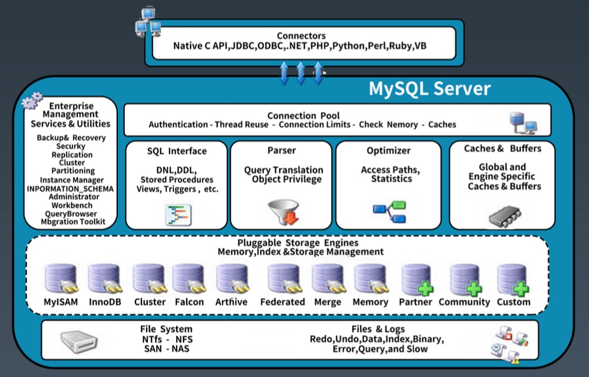

2.   MySQL 存储

     -   独占模式

         >   日志组文件:ib_logfile0 和 ib_logfile1，默认均为5M 
         >
         >   表结构文件:*.frm
         >
         >   独占表空间文件:*.ibd 4)、字符集和排序规则文件:db.opt
         >
         >   binlog 二进制日志文件:记录主数据库服务器的 DDL 和 DML 操作 
         >
         >   二进制日志索引文件:master-bin.index

     -   共享模式 innodb_file_per_table=OFF

         >   数据都在 ibdata1

3.   MySQL 简化执行流程

     -   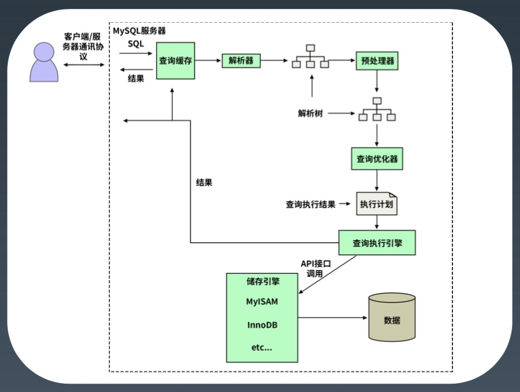

4.   MySQL 详细执行流程

     -   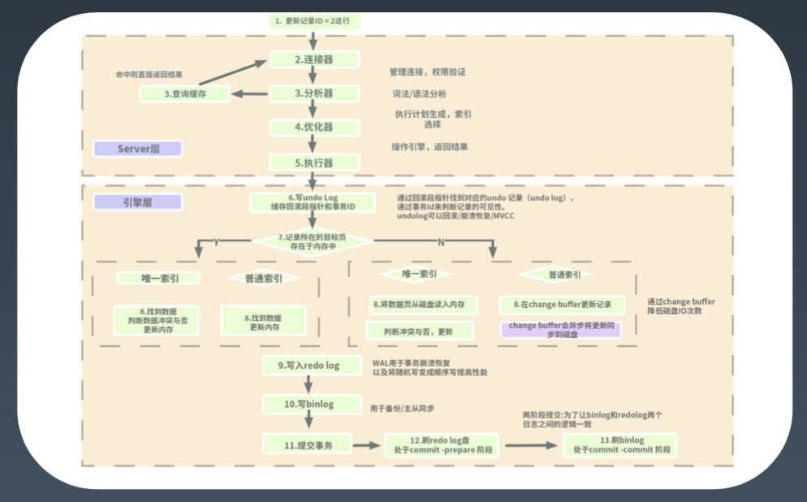

5.   MySQL 执行引擎和状态

     -   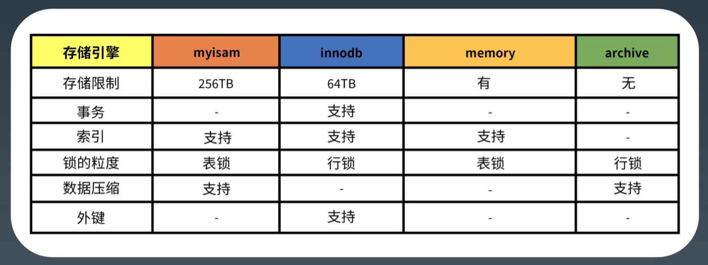

6.   MySQL 对 SQL 执行顺序

     -   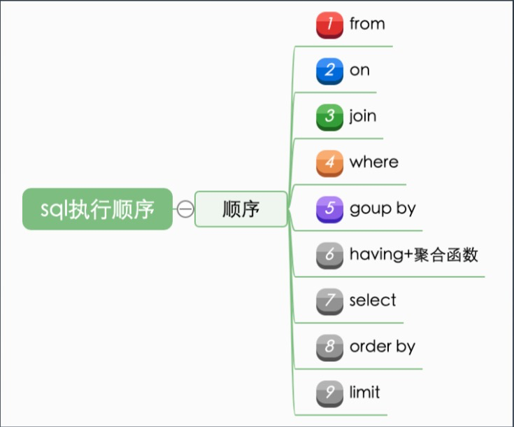

7.   MySQL 索引原理

     -   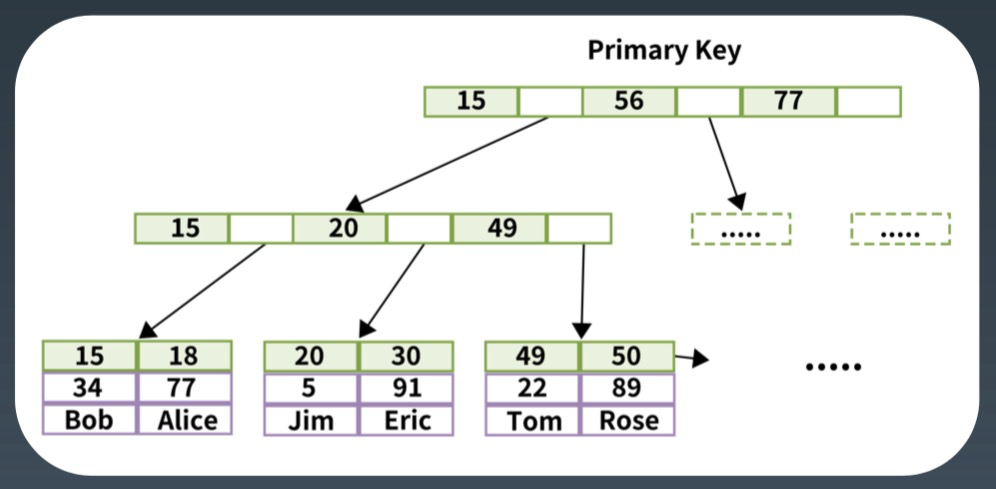

###  MySQL 配置优化*

1.   参数配置优化

     -   连接请求的变量

         >   max_connections
         >
         >   back_log 
         >
         >   wait_timeout 和 interative_timeout

     -   缓冲区变量

         >   key_buffer_size 
         >
         >   query_cache_size (查询缓存简称 QC) 
         >
         >   max_connect_errors 
         >
         >   sort_buffer_size 8、max_allowed_packet=32M 
         >
         >   join_buffer_size=2M 
         >
         >   thread_cache_size=300

     -   配置 Innodb 的几个变量

         >   innodb_buffer_pool_size=128M 
         >
         >   innodb_flush_log_at_trx_commit 
         >
         >   innodb_thread_concurrency=0 
         >
         >   innodb_log_buffer_size 
         >
         >   innodb_log_file_size=50M 
         >
         >   innodb_log_files_in_group=3 
         >
         >   read_buffer_size=1M 
         >
         >   read_rnd_buffer_size=16M 
         >
         >   bulk_insert_buffer_size=64M 
         >
         >   binary log

### 数据库设计优化*

1.   最佳实践
     -   如何恰当选择引擎?
     -   库表如何命名?
     -   如何合理拆分宽表?
     -   如何选择恰当数据类型: 明确、尽量小
         -   char、varchar 的选择
         -   (text/blob/clob)的使用问题? 
         -   文件、图片是否要存入到数据库? 
         -   时间日期的存储问题?
         -   数值的精度问题?
     -   是否使用外键、触发器?
     -   唯一约束和索引的关系?
     -   是否可以冗余字段?
     -   是否使用游标、变量、视图、自定义函数、存储过程? - 自增主键的使用问题?
     -   能够在线修改表结构(DDL 操作)?
     -   逻辑删除还是物理删除?
     -   要不要加 create_time,update_time 时间戳?
     -   数据库碎片问题?
     -   如何快速导入导出、备份数据?

### MySQL 事务 && 锁

1.   事务可靠性模型 -- ACID
     -   Atomicity:  原子性，一次事务中的操作要么全部成功，要么全部失败。 
     -   Consistency:  一致性，跨表、跨行、跨事务，数据库始终保持一致状态。 
     -   Isolation:  隔离性，可见性，保护事务不会互相干扰，包含4种隔离级别。 
     -   Durability:  持久性，事务提交成功后，不会丢数据。如电源故障，系统崩溃。
2.   InnoDB 
3.   表级锁
4.   行级锁
5.   死锁
6.   4 种事务隔离级别
     -   读未提交: READ UNCOMMITTED
     -   读已提交: READ COMMITTED
     -   可重复读: REPEATABLE READ
     -   可串行化: SERIALIZABLE

### DB 与 SQL 优化

1.   建表期

     -   **数据类型** -- 尽量取小

         -   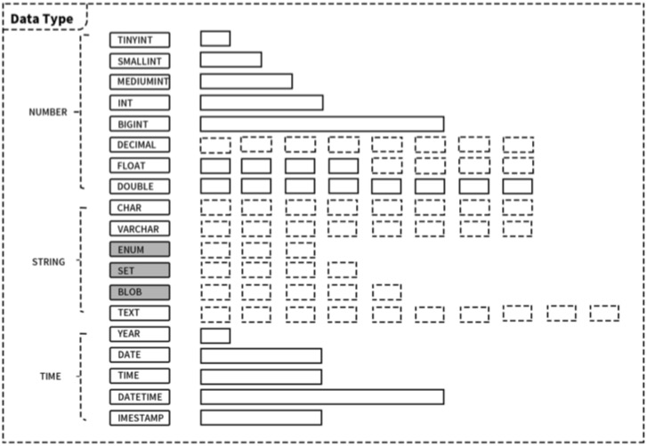

     -   **存储引擎**

         -   Innodb

             >   聚焦索引
             >
             >   锁粒度是行锁
             >
             >   InnoDB 支持事务
             >
             >   
             >
             >
             >   没有其他特别因素就用 InnoDB

         -   ToKuDB

             >   高压缩比，尤其适用于压缩和归档(1:12) 
             >
             >   在线添加索引，不影响读写操作
             >
             >   支持完整的 ACID 特性和事务机制
             >
             >   
             >
             >
             >   归档库

     -   表设计

         >   DBA 的指导手册/dbaprinciples

2.   使用期

     -   隐匿转换问题

         >   查询错误
         >
         >   性能降低，不走索引
         >
         >   
         >
         >   where 条件中注意数据类型，避免类型转换

     -   定位问题

         >   慢日志
         >
         >   监控
         >
         >   
         >
         >   解决方案：添加索引

     -   索引类型

         -   Hash
         -   B-Tree
             -   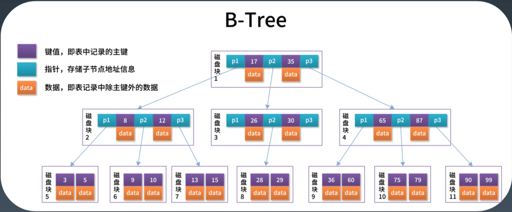
         -   B+Tree
             -   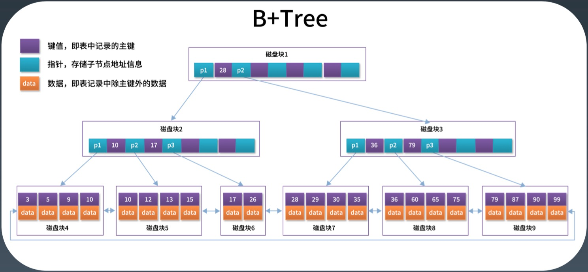

     -   为什么主键单调递增 -- 防止页分裂

         -   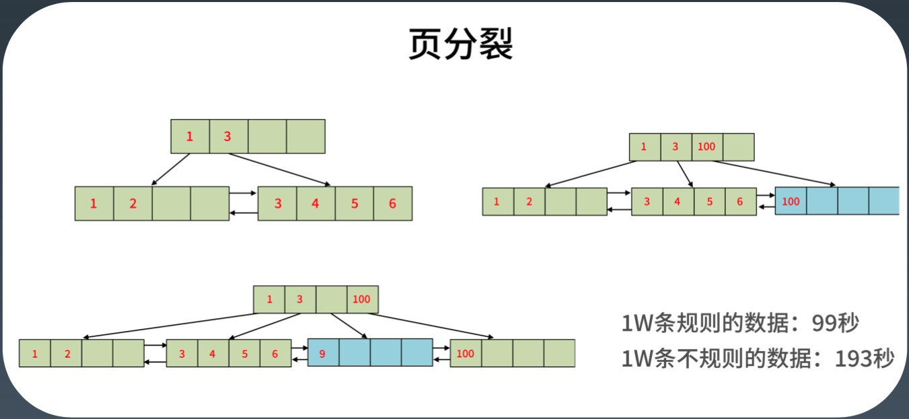

     -   索引思考

         -   为什么不适用 hash index
         -   为什么 b+tree 更适合做索引
         -   为什么主键长度不能过长

     -   聚焦索引 vs 二级索引

         -   聚焦索引（主键索引）

             >   B+tree 就是以主键做索引

         -   二级索引 （其他索引）

             >   通过二级索引查到数据的主键 Id
             >
             >   再回表查数据
             
         -   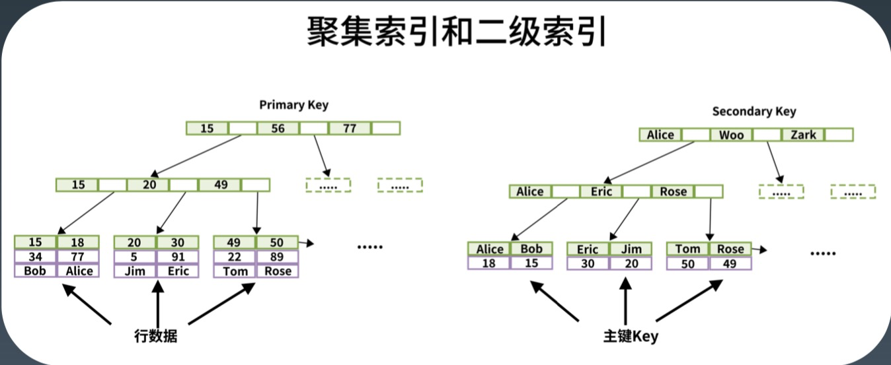

     -   字段选择性

         >   某个字段的重复程序，称为该字段的选择性
         >
         >   F = DISTINCT(col)/count(*)

     -   索引冗余

         >   长的包括短的，形成冗余
         >
         >   有唯一约束的，组合冗余

     -   修改表结构的危害

         >   索引重建
         >
         >   锁表
         >
         >   抢占资源
         >
         >   主从延时

     -   数据量

         >   业务初期考虑不周，字段类型使用不合理，需要变更数据类型
         >
         >   随着业务的发展，需要增加新的字段　--　尽量增加从表实现
         >
         >   增加索引

3.   优化总结

     -   写入优化

         >   大批量写入的优化
         >
         >   PreparedStatement 减少 SQL 解析
         >
         >   Multiple Values/Add Batch 减少交互
         >
         >   Load Data，直接导入
         >
         >   索引和约束问题

     -   数据更新

         >   数据的范围更新
         >
         >   注意 GAP Lock 的问题
         >
         >   导致锁范围扩大

     -   模糊查询

         >   Like 的问题
         >
         >   前缀匹配
         >
         >   否则不走索引
         >
         >   全文检索
         >
         >    其它建议，solr/ES

     -   连接查询

         >   连接查询优化
         >
         >   驱动表的选择问题
         >
         >   避免筁卡尔积

     -   索引失效

         >   索引失效情况汇总：
         >
         >   NULL, not, not in, 函数等
         >
         >   减少使用 or，可以用 union（注意与union all 区别），以及前面提到的 like
         >
         >   大数据量下，放弃所有条件组合都走索引的幻想，出门左拐“全文检索” 
         >
         >   必要时可以使用 force index 来强制查询走某个索引

     -   查询 SQL 到底怎么设计？

         >   查询数据量和查询次数的平衡
         >
         >   避免不必须的大量重复数据传输
         >
         >   避免使用临时文件排序或临时表
         >
         >   分析类需求，可以用汇总表

### 常见场景分析

1.   主键 ID

     -   自增
     -   sequence，MySQL 不支持
     -   模拟 seq
     -   UUID
     -   时间戳/随机数
     -   snowflake

2.   高效分页

     -   分页

         >   count/pageSize/pageNum, 带条件的查询语句
         >
         >   常见实现-分页插件:使用查询 SQL，嵌套一个 count，性能的坑? 

     -   改进1，重写 count

         >   大数量级分页的问题，limit 100000,20

     -   改进2，反序

     -   改进3，技术向:带 id

     -   改进4，需求向:非精确分页

     -   改进 5，全文索引

3.   乐观锁和悲观锁

     -   悲观锁 -> 乐观锁

### 单机 >> 集群

1.   单机 MySQL 面临的几个问题
     -   容量有限，难以扩容
     -   读写压力，QPS 过大，特别是分析类需求会影响到业务事务 
     -   可用性不足，宕机问题
2.   MySQL 的技术演进
     -   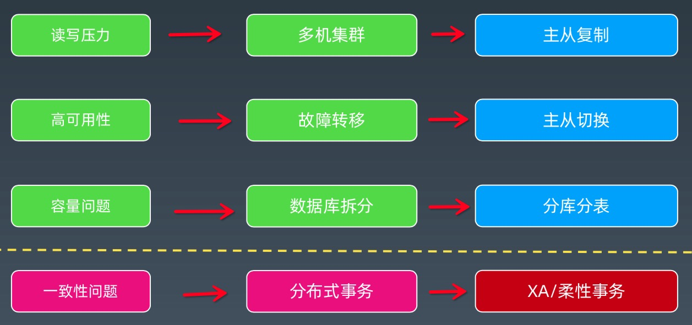

### 主从复制

1.   核心
     -   主库写 binlog
     -   从库 relay log
2.   发展
     -   2000年，MySQL 3.23.15版本引入了复制
     -   2002年，MySQL 4.0.2版本分离 IO 和 SQL 线程，引入了 relay log
     -   2010年，MySQL 5.5版本引入半同步复制
     -   2016年，MySQL 在5.7.17中引入 InnoDB Group Replication
3.   流程图
     -   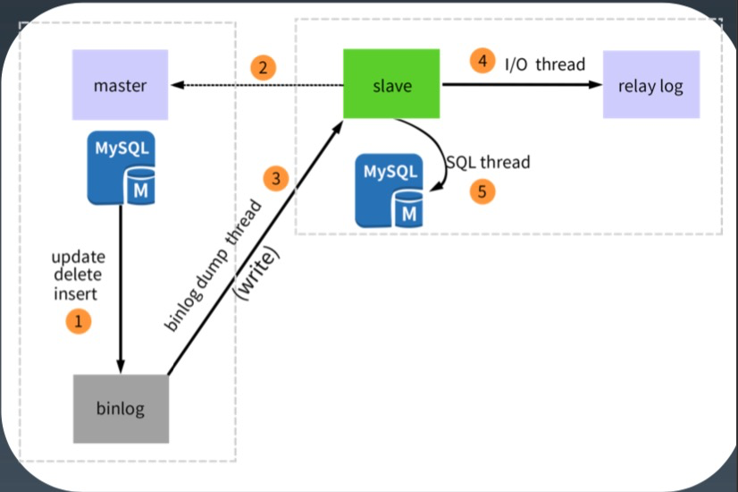
4.   binlog 格式
     -   ROW
     -   Statement 
     -   Mixed
5.   原理
     -   异步复制: 传统主从复制--2000年，MySQL 3.23.15版本引入了 Replication
         -   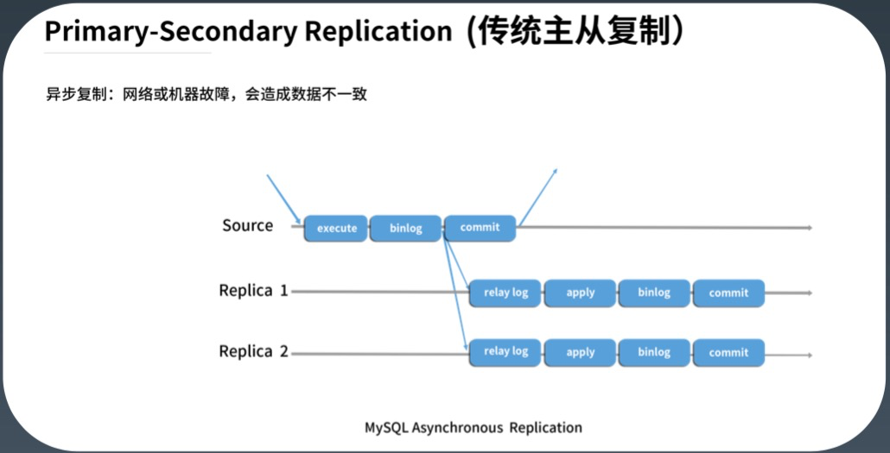
     -   半同步复制: 需要启用插件
         -   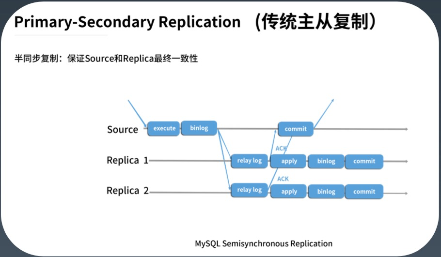
     -   组复制:
         -   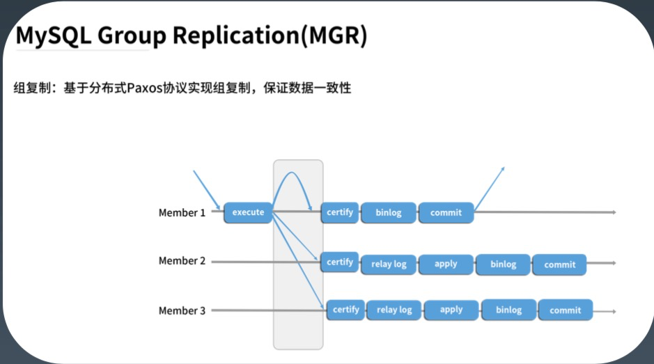
6.   局限性
     -   主从延迟问题
     -   应用侧需要配合读写分离框架 
     -   不解决高可用问题

### 读写分离

### 高可用

