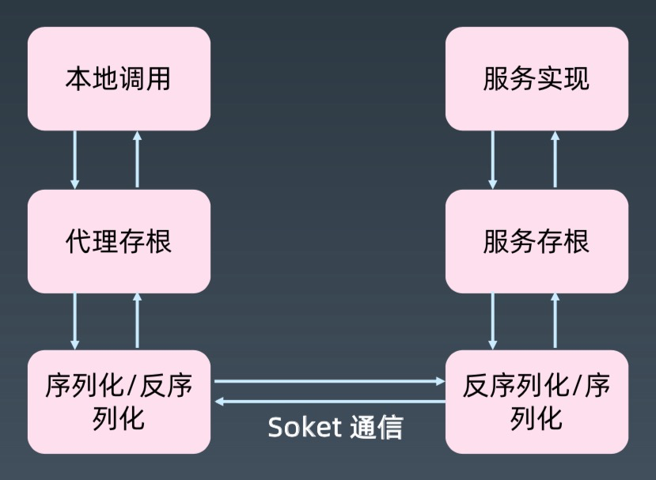
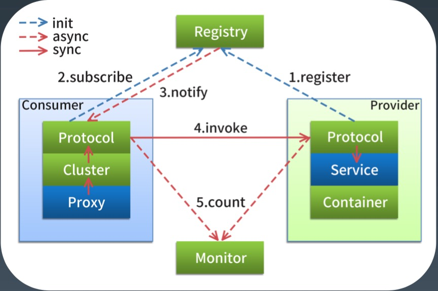
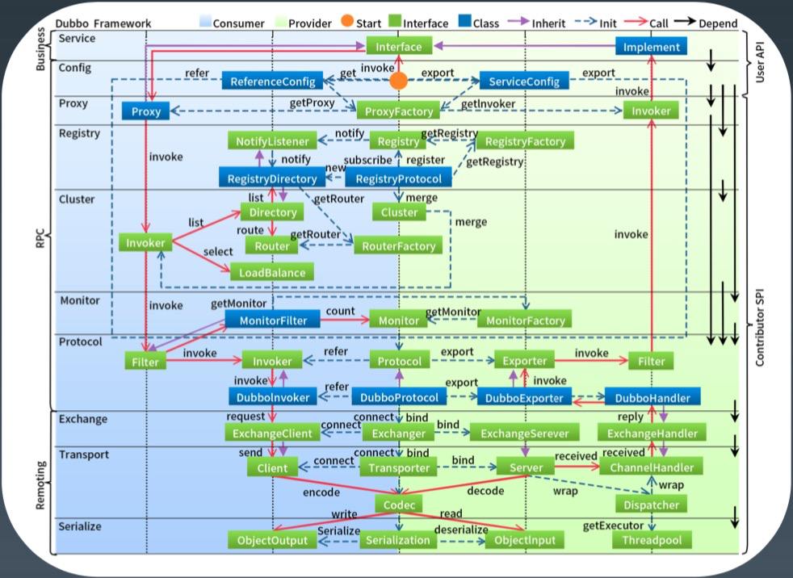

[toc]

## 分布式服务 1

### RPC 基本原理*

1.   RPC 是什么？

     -   介绍

         >   RPC 是远程过程调用(Remote Procedure Call)的缩写形式。
         >
         >   RPC 的概念与技术早在1981年由 Nelson 提出。
         >
         >   1984年，Birrell 和 Nelson 把其用于支持异构型分布式系统间的通讯。Birrell 的 RPC 模型引入存 根进程( stub) 作为远程的本地代理，调用 RPC 运行时库来传输网络中的调用。Stub 和 RPC runtime 屏蔽了网络调用所涉及的许多细节，特别是，参数的编码/译码及网络通讯是由 stub 和 RPC runtime 完成的，因此这一模式被各类 RPC 所采用。

     -   定义

         >   像调用本地方法一样调用远程方法

2.   RPC 原理

     -   简化版原理图

         -   

     -   通信流程

         >   本地代理存根: Stub 
         >
         >   本地序列化反序列化 
         >
         >   网络通信 
         >
         >   远程序列化反序列化 
         >
         >   远程服务存根: Skeleton 
         >
         >   调用实际业务服务 
         >
         >   原路返回服务结果 
         >
         >   返回给本地调用方

3.   重点 1 -- 设计

     -   RPC 是基于接口的远程服务调用。

     -   本地应用程序与远程应用程序，分别需要共享什么信息，角色有什么不同?

         >   共享：POJO 实体类定义、接口定义。　-- >> 接口契约
         >
         >   角色：远程->服务提供者，本地->服务消费者。

4.   重点 2 -- 代理

     -   RPC 是基于接口的远程服务调用。
     -   Java 下，代理可以选择动态代理，或者 AOP 实现

5.   重点 3 -- 序列化

     -   选择

         >   语言原生的序列化，RMI，Remoting 
         >
         >   二进制平台无关，Hessian，avro，kyro，fst 等 
         >
         >   文本，JSON、XML 等

6.   重点 4 -- 网络传输

     -   常见的传输方式

         >   TCP/SSL/TLS 
         >
         >   HTTP/HTTPS

7.   重点 5 --  查找实现类

     -   通过接口查找服务端的实现类。

     -   一般是注册方式

         >   例如 dubbo 默认将接口和实现类配置到 Spring

### RPC 技术框架*

1.   常见的 **RPC** 技术
     -   Corba/RMI/.NET Remoting
     -   JSON RPC, XML RPC，WebService(Axis2, CXF) 
     -   Hessian, Thrift, Protocol Buffer, gRPC

### 如何设计一个 RPC*

1.   基于共享接口还是 IDL?
2.   动态代理 or AOP? 
3.   序列化用什么?
4.   文本 or 二进制? 
5.   基于 TCP 还是 HTTP? 
6.   服务端如何查找实现类? 
7.   异常处理

### 从 RPC 到分布式服务化

1.   多个相同服务如何管理? 
2.   服务的注册发现机制?
3.   如何负载均衡，路由等集群功能? 
4.   熔断，限流等治理能力。 
5.   重试等策略。 
6.   高可用、监控、性能等等。

### Dubbo 框架介绍*

1.   发展历史

     -   开源期(2011-2013): Dubbo 是阿里巴巴 B2B 开发的，2011年开源。 
     -   沉寂期(2013-2017): 2013年到2017年，Dubbo 的维护程度很低。
     -   复兴期(2017-2019): 2017年8月份重启维护，2018年2月加入 Apache 孵化器， 
     -   2019年5月顺利毕业。

2.   六大核心功能

     -   高性能 RPC 调用
     -   智能负载均衡
     -   服务自动注册和发现
     -   高度可扩展能力
     -   运行期流量调度
     -   可视化的服务治理与运维

3.   基础功能：RPC 调用

     -   特性

         >   多协议(序列化、传输、RPC) 
         >
         >   服务注册发现
         >
         >   配置、元数据管理

     -   架构图

         -   

4.   扩展功能：集群、高可用、管控 

     -   特性

         >   集群，负载均衡
         >
         >   治理，路由，
         >
         >   控制台，管理与监控
         >
         >   

### Dubbo 技术原理*

1.   整体架构

     -   

2.   架构解析

     -   config 配置层

         >   对外配置接口，以 ServiceConfig, ReferenceConfig 为中心，可以直接初始化配置类， 也可以通过 spring 解析配置生成配置类

     -   proxy 服务代理层

         >   服务接口透明代理，生成服务的客户端 Stub 和服务器端 Skeleton, 以 ServiceProxy 为中心，扩展接口为 ProxyFactory

     -   egistry 注册中心层

         >   封装服务地址的注册与发现，以服务 URL 为中心，扩展接口为 RegistryFactory, Registry, RegistryService

     -   cluster 路由层

         >   封装多个提供者的路由及负载均衡，并桥接注册中心，以 Invoker 为中心，扩展接口为 Cluster，Directory，Router，LoadBalance

     -   monitor 监控层

         >   RPC 调用次数和调用时间监控，以 Statistics 为中心，扩展接口为 MonitorFactory, Monitor, MonitorService

     -   protocol 远程调用层

         >   封装 RPC 调用，以 Invocation，Result 为中心，扩展接口为 Protocol， Invoker，Exporter

     -   exchange 信息交换层

         >   封装请求响应模式，同步转异步，以 Request，Response 为中心，扩展接口为 Exchanger，ExchangeChannel，ExchangeClient，ExchangeServer

     -   transport 网络传输层

         >   抽象 mina 和 netty 为统一接口，以 Message 为中心，扩展接口为 Channel， Transporter，Client，Server，Codec

     -   serialize 数据序列化层

         >   可复用的一些工具，扩展接口为 Serialization，ObjectInput， ObjectOutput， ThreadPool

3.   框架设计

     -   

4.   **SPI** 的应用

     -   SPI 与 API
     -   ServiceLoader 机制 META-INF/接口全限定名，文件内容为实现类
     -   Dubbo 的 SPI 扩展，最关键的 SPI: Protocol
         -   xxx=com.alibaba.xxx.XxxProtocol
         -   启动时装配，并缓存到 ExtensionLoader 中。

### Dubbo 应用场景

1.   分布式服务化改造

     -   业务系统规模复杂，垂直拆分改造

         >   数据改造
         >
         >   服务设计
         >
         >   团队的配合
         >
         >   开发、测试、运维

2.   开放平台

     -   平台发展的两个模式
         -   开放模式
         -   容器模式
     -   将公司的业务能力开发出来，形成开发平台，对外输出业务或技术能力。 
     -   API 与 SPI，分布式服务化与集中式 ESB

3.   BFF

     -    BFF (Backend For Frontend), 直接作为前端使用的后端
     -   不太建议这种用法。建议向中台发展

4.   中台

     -   将公司的所有业务服务能力，包装成 API，形成所谓的业务中台。 
     -   前端业务服务，各个业务线，通过调用中台的业务服务，灵活组织自己的业务。 
     -   从而实现服务的复用能力，以及对于业务变化的快速响应。

### Dubbo 最佳实践*

1.   开发分包

     -   建议将服务接口、服务模型、服务异常等均放在 API 包中

         >   因为服务模型和异常也是 API 的一部 分，这样做也符合分包原则:重用发布等价原则(REP)，共同重用原则(CRP)。

     -   服务接口尽可能大粒度

         >   每个服务方法应代表一个功能，而不是某功能的一个步骤，否则将面临分 布式事务问题，Dubbo 暂未提供分布式事务支持。

     -   服务接口建议以业务场景为单位划分，并对相近业务做抽象，防止接口数量爆炸。

     -   不建议使用过于抽象的通用接口，

         >   如:Map query(Map)，这样的接口没有明确语义，会给后期维 护带来不便。

2.   环境隔离与分组

     -   部署多套? 
     -   多注册中心机制 
     -   group 机制 
     -   版本机制

3.   参数配置

     -   通用参数以 consumer 端为准，如果 consumer 端没有设置，使用 provider 数值

     -   建议在 Provider 端配置的 Consumer 端属性

         >   timeout: 方法调用的超时时间 
         >
         >   retries: 失败重试次数，缺省是 2 
         >
         >   loadbalance: 负载均衡算法，缺省是随机 random。
         >
         >   actives: 消费者端的最大并发调用限制，即当 Consumer 对一个服务的并发调用到上限后，新调用会阻塞直 到超时，可以配置在方法或服务上。

     -   建议在 Provider 端配置的 Provider 端属性

         >   threads: 服务线程池大小
         >
         >   executes: 一个服务提供者并行执行请求上限，即当 Provider 对一个服务的并发调用达到上限后，新调用会 阻塞，此时 Consumer 可能会超时。可以配置在方法或服务上。

4.   容器化部署

     -   注册的IP问题，**容器内**提供者使用的 IP，如果注册到 zk，消费者无法访问。

     -   解决办法

         1.   docker 使用宿主机网络

              >   docker xxx -net xxxxx

         2.   docker 参数指定注册的IP和端口，-e

              >   DUBBO_IP_TO_REGISTRY — 注册到注册中心的 IP 地址 
              >
              >   DUBBO_PORT_TO_REGISTRY — 注册到注册中心的端口 
              >
              >   DUBBO_IP_TO_BIND — 监听 IP 地址 
              >
              >   DUBBO_PORT_TO_BIND — 监听端口

5.   运维与监控

     -   可观测性: tracing、metrics、logging(ELK)

6.   分布式事务

     -   柔性事务，SAGA、TCC、AT
     -   Seata
     -   hmily + dubbo

7.   重试与幂等

     -   服务调用失败默认重试2次，如果接口不是幂等的，会造成业务重复处理。

     -   如何设计幂等接口?

         >   去重-->(bitmap --> 16M)，100w
         >   乐观锁机制,

### Dubbo 源码

1.   重点模块

     -   common

     -   config

     -   filter 

     -   rpc/remoting/serialization

     -   集群与分布式

         >   cluster 
         >
         >   registry/configcenter/metadata

2.   学习源码技巧

     -   不要一上来就关注与每行代码，挑**重点代码，重点类，重点方法**看。 (跟看书一样)
     -   最好在跑起来的 demo 里 Dubbo 重点类和方法打断点，**debug 的过程跟踪看**。(推荐做笔记)
     -   最好组成一个小组，大家相互深入研究，然后相互分享，节省时间，系统学习。 (费曼学习法)

