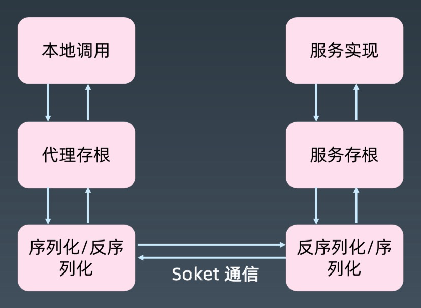
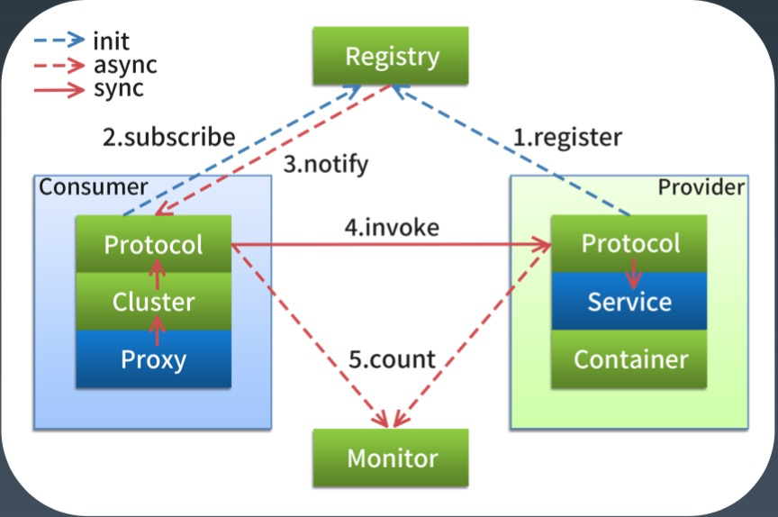
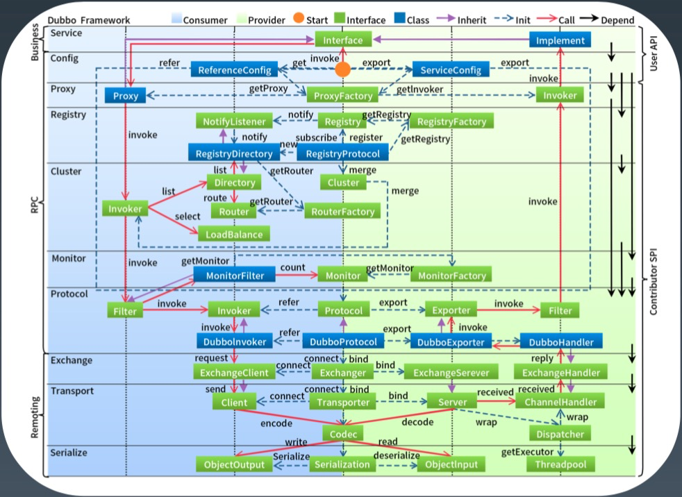
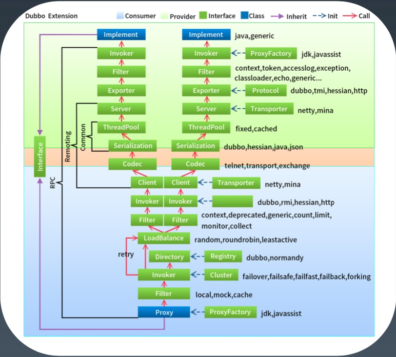

[toc]

## 分布式服务

### RPC 基本原理*

1.   RPC 是什么？

     -   介绍

         >   RPC 是远程过程调用(Remote Procedure Call)的缩写形式。
         >
         >   RPC 的概念与技术早在1981年由 Nelson 提出。
         >
         >   1984年，Birrell 和 Nelson 把其用于支持异构型分布式系统间的通讯。Birrell 的 RPC 模型引入存 根进程( stub) 作为远程的本地代理，调用 RPC 运行时库来传输网络中的调用。Stub 和 RPC runtime 屏蔽了网络调用所涉及的许多细节，特别是，参数的编码/译码及网络通讯是由 stub 和 RPC runtime 完成的，因此这一模式被各类 RPC 所采用。

     -   定义

         >   像调用本地方法一样调用远程方法

2.   RPC 原理

     -   简化版原理图

         -   

     -   通信流程

         >   本地代理存根: Stub 
         >
         >   本地序列化反序列化 
         >
         >   网络通信 
         >
         >   远程序列化反序列化 
         >
         >   远程服务存根: Skeleton 
         >
         >   调用实际业务服务 
         >
         >   原路返回服务结果 
         >
         >   返回给本地调用方

3.   重点 1 -- 设计

     -   RPC 是基于接口的远程服务调用。

     -   本地应用程序与远程应用程序，分别需要共享什么信息，角色有什么不同?

         >   共享：POJO 实体类定义、接口定义。　-- >> 接口契约
         >
         >   角色：远程->服务提供者，本地->服务消费者。

4.   重点 2 -- 代理

     -   RPC 是基于接口的远程服务调用。
     -   Java 下，代理可以选择动态代理，或者 AOP 实现

5.   重点 3 -- 序列化

     -   选择

         >   语言原生的序列化，RMI，Remoting 
         >
         >   二进制平台无关，Hessian，avro，kyro，fst 等 
         >
         >   文本，JSON、XML 等

6.   重点 4 -- 网络传输

     -   常见的传输方式

         >   TCP/SSL/TLS 
         >
         >   HTTP/HTTPS

7.   重点 5 --  查找实现类

     -   通过接口查找服务端的实现类。

     -   一般是注册方式

         >   例如 dubbo 默认将接口和实现类配置到 Spring

### RPC 技术框架*

1.   常见的 **RPC** 技术
     -   Corba/RMI/.NET Remoting
     -   JSON RPC, XML RPC，WebService(Axis2, CXF) 
     -   Hessian, Thrift, Protocol Buffer, gRPC

### 如何设计一个 RPC*

1.   基于共享接口还是 IDL?
2.   动态代理 or AOP? 
3.   序列化用什么?
4.   文本 or 二进制? 
5.   基于 TCP 还是 HTTP? 
6.   服务端如何查找实现类? 
7.   异常处理

### 从 RPC 到分布式服务化

1.   多个相同服务如何管理? 
2.   服务的注册发现机制?
3.   如何负载均衡，路由等集群功能? 
4.   熔断，限流等治理能力。 
5.   重试等策略。 
6.   高可用、监控、性能等等。

### Dubbo 框架介绍*

1.   发展历史

     -   开源期(2011-2013): Dubbo 是阿里巴巴 B2B 开发的，2011年开源。 
     -   沉寂期(2013-2017): 2013年到2017年，Dubbo 的维护程度很低。
     -   复兴期(2017-2019): 2017年8月份重启维护，2018年2月加入 Apache 孵化器， 
     -   2019年5月顺利毕业。

2.   六大核心功能

     -   高性能 RPC 调用
     -   智能负载均衡
     -   服务自动注册和发现
     -   高度可扩展能力
     -   运行期流量调度
     -   可视化的服务治理与运维

3.   基础功能：RPC 调用

     -   特性

         >   多协议(序列化、传输、RPC) 
         >
         >   服务注册发现
         >
         >   配置、元数据管理

     -   架构图

         -   

4.   扩展功能：集群、高可用、管控 

     -   特性

         >   集群，负载均衡
         >
         >   治理，路由，
         >
         >   控制台，管理与监控
         >
         >   

### Dubbo 技术原理*

1.   整体架构

     -   

2.   架构解析

     -   config 配置层

         >   对外配置接口，以 ServiceConfig, ReferenceConfig 为中心，可以直接初始化配置类， 也可以通过 spring 解析配置生成配置类

     -   proxy 服务代理层

         >   服务接口透明代理，生成服务的客户端 Stub 和服务器端 Skeleton, 以 ServiceProxy 为中心，扩展接口为 ProxyFactory

     -   egistry 注册中心层

         >   封装服务地址的注册与发现，以服务 URL 为中心，扩展接口为 RegistryFactory, Registry, RegistryService

     -   cluster 路由层

         >   封装多个提供者的路由及负载均衡，并桥接注册中心，以 Invoker 为中心，扩展接口为 Cluster，Directory，Router，LoadBalance

     -   monitor 监控层

         >   RPC 调用次数和调用时间监控，以 Statistics 为中心，扩展接口为 MonitorFactory, Monitor, MonitorService

     -   protocol 远程调用层

         >   封装 RPC 调用，以 Invocation，Result 为中心，扩展接口为 Protocol， Invoker，Exporter

     -   exchange 信息交换层

         >   封装请求响应模式，同步转异步，以 Request，Response 为中心，扩展接口为 Exchanger，ExchangeChannel，ExchangeClient，ExchangeServer

     -   transport 网络传输层

         >   抽象 mina 和 netty 为统一接口，以 Message 为中心，扩展接口为 Channel， Transporter，Client，Server，Codec

     -   serialize 数据序列化层

         >   可复用的一些工具，扩展接口为 Serialization，ObjectInput， ObjectOutput， ThreadPool

3.   框架设计

     -   

4.   **SPI** 的应用

     -   SPI 与 API
     -   ServiceLoader 机制 META-INF/接口全限定名，文件内容为实现类
     -   Dubbo 的 SPI 扩展，最关键的 SPI: Protocol
         -   xxx=com.alibaba.xxx.XxxProtocol
         -   启动时装配，并缓存到 ExtensionLoader 中。

### Dubbo 应用场景

### Dubbo 最佳实践*

### Dubbo 源码

### 最佳实践

### Spring Cloud

