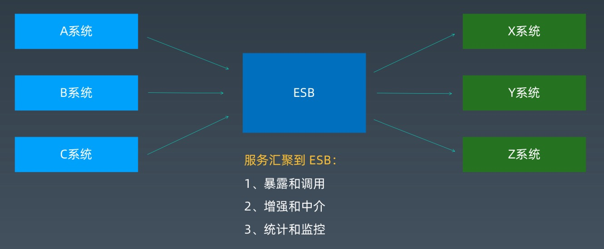
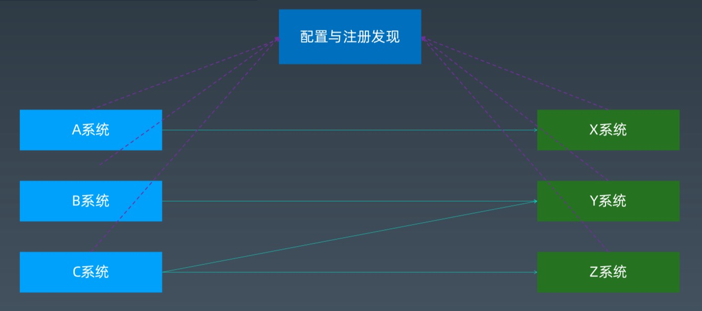
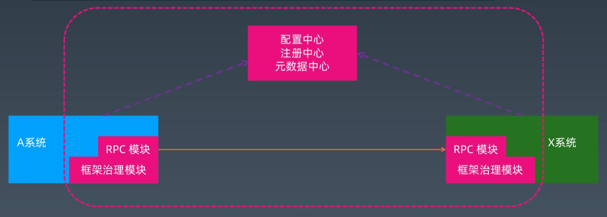
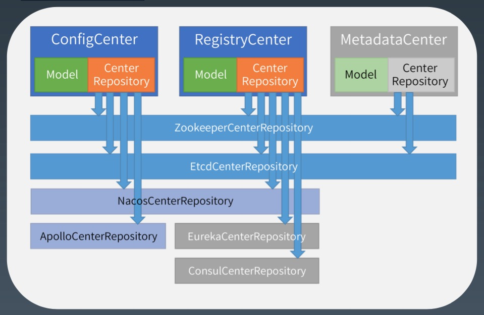

[toc]

## 08-分布式服务 2

### 分布式服务治理/配置/注册/元数据中心

1.   分布式服务治理

     -   分布式业务场景中，除了远程调用，还需要考虑什么?

         >   多个相同服务如何管理? ==> 集群/分组/版本 => 分布式与集群 
         >
         >   服务的注册发现机制? ==> 注册中心/注册/发现
         >
         >   如何负载均衡，路由等集群功能? ==> 路由/负载均衡 
         >
         >   熔断，限流等治理能力。 ==> 过滤/流控 
         >
         >   心跳，重试等策略。
         >
         >   高可用、监控、性能等等。

2.   RPC 与分布式服务化的区别

     -   RPC

         >   技术概念
         >
         >   以 RPC 来讲，我们前面的自定义 RPC 功能已经差不多了。
         >
         >   可以再考虑一下性能优化，使用 spring-boot 等封装易用性。

     -   分布式服务化

         >   服务是业务语义，偏向于业务与系统的集成
         >
         >   还差非功能性需求能力
         >
         >   另外一个重点是如何设计分布式的业务服务。

     -   注意

         >   服务 != 接口
         >
         >   服务可以用接口或接口文档之类的语言描述。

3.   分布式服务化与 SOA/ESB 的区别

     -   SOA/ESB:代理调用，直接增强
         -   
     -   分布式服务化:直连调用，侧边增强
         -   
     -   分布式服务化与 SOA/ESB 的区别
         -   上面的配置/注册/发现等就演化成了代替 ESB 容器的新组件: 配置中心、注册中心等。
         -   RPC 之上的增强
             -   有状态的部分，放到 xx 中心 
             -   无状态的部分，放到应用侧(具体来说是框架和配置部分，尽量不影响业务代码)
             -   

4.   配置、注册、元数据，有何异同?

     -   定义
         -   配置中心 (ConfigCenter)

             >   管理系统需要的配置参数信息 

         -   注册中心 (RegistryCenter)

             >   管理系统的服务注册、提供发现和协调能力 

         -   元数据中心 (MetadataCenter)

             >   管理各个节点使用的元数据信息

     -   相同点

         >   都需要保存和读取数据/状态，变更通知 

     -   不同点

         >   配置 是 全局非业务参数，
         >
         >   注册中心 是 运行期临时状态，
         >
         >   元数据 是 业务模型

5.   为什么需要配置中心？

     -   大规模集群下，如何管理配置信息，特别是批量更新问题。 
     -   大公司和金融行业，一般要求开发、测试、运维分离(物理隔离)。 
     -   运行期的一些开关控制，总不能不断重启??

6.   为什么会需要注册中心?

     -   hello.htm -> ok
     -   DNS?VIP?
     -   主动报告+心跳

7.   为什么会需要元数据中心?

     -   定义了所有业务服务的模型。

8.   如何实现 XX 中心?

     -   核心要素

         >   需要有存取数据的能力，特别是临时数据的能力。 
         >
         >   需要有数据变化的实时通知机制，全量或增量。

     -   以某开源软件为例

         -   

### 服务的注册与发现/集群与路由/过滤与流控

1.   服务注册

     -   服务提供者
     -   启动时，将自己注册到注册中心(比如 zk 实现)的临时节点。
     -   停止或者宕机时，临时节点消失。

2.   服务发现

     -   服务消费者
     -   启动时，从注册中心代表服务的主节点拿到多个代表提供者的临时节点列表，并本地缓存(why???)。
     -   如果可用的提供者集合发生变化时，注册中心通知消费者刷新本地缓存的列表。

3.   服务集群

     -   协同工作，分摊处理流量。

4.   服务路由

     -   基于 IP 段的过滤，
     -   用 tag 匹配这次调用范围。

5.   服务负载均衡

     -   负载策略

         >   Random(带权重)== dubbo 默认的策略 
         >
         >   RoundRobin(轮询)
         >
         >   LeastActive(快的多给) 
         >
         >   ConsistentHashLoadBalance(同样参数请求到一个提供者)

6.   服务过滤

     -   所有的复杂处理，都可以抽象为**管道+过滤器模式**(Channel+Filter)

7.   服务流控

     -   为什么需要流控
      
         -   稳定性工程
         -   容量有限
        
     -   三个级别
      
         >   限流  (内部线程数，外部调用数或数据量) 
         >
         >   服务降级  (去掉不必要的业务逻辑，只保留核心逻辑) 
         >
         >   过载保护  (系统短时间不提供新的业务处理服务，积压处理完后再恢复输入请求)

### 微服务架构发展历程与应用场景

### 微服务架构最佳实践

1.   最佳实践 - 01  遗留系统改造

     -   功能剥离、数据解耦
     -   自然演进、逐步拆分
     -   小步快跑、快速迭代
     -   灰度发布、谨慎试错
     -   提质量线、还技术债

2.   最佳实践 - 02  恰当粒度拆分

     -   拆分原则

         >   高内聚、低耦合
         >
         >   不同阶段拆分要点不同

3.   最佳实践 - 03  扩展立方体 - AFK

     -   水平复制: 复制系统 
     -   功能解耦: 拆分业务 
     -   数据分区: 切分数据

4.   最佳实践 - 04  自动化管理

     -   自动化测试 
     -   自动化部署 
     -   自动化运维

5.   最佳实践 - 05  分布式事务

     -   幂等/去重/补偿 
     -   慎用分布式事务!

6.   最佳实践 - 06  完善监控体系

     -   业务监控 
     -   系统监控 
     -   容量规划 
     -   报警预警 
     -   运维流程 
     -   故障处理

